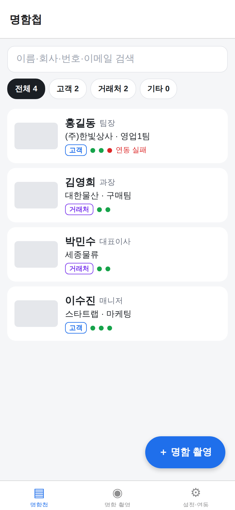
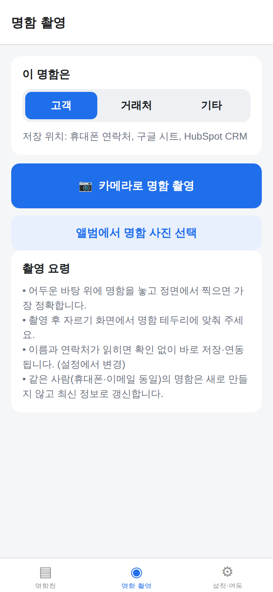
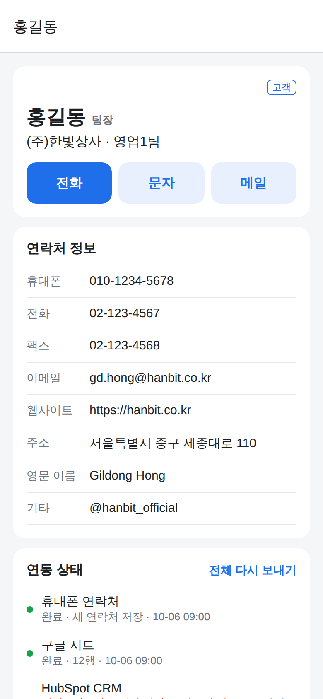
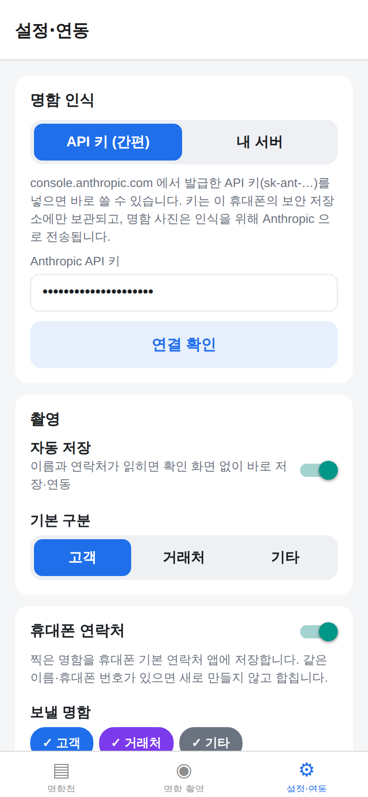

# 명함스캔 (cardscan)

리멤버처럼 **명함을 찍으면 자동으로 읽어서 저장**하고, **휴대폰 연락처와 업무 시스템(구글 시트·HubSpot·ERP 웹훅·슬랙)에 자동 입력**하는 모바일 앱입니다.
iOS·Android 공용(Expo / React Native).

| 명함첩 | 촬영 | 상세·연동 상태 | 설정·연동 |
|---|---|---|---|
|  |  |  |  |

## 안드로이드 휴대폰에 설치하기 (5분)

1. **설치 파일 받기** — 휴대폰 브라우저로
   **https://github.com/himan98hkt-prog/-/releases/tag/cardscan-android** 에 들어가
   *Assets* 의 `cardscan-v….apk` 를 눌러 내려받습니다.
   (cardscan 폴더가 바뀌어 올라갈 때마다 GitHub Actions 가 자동으로 새로 빌드해 이 주소에 올립니다.)
2. **설치** — 다운로드 알림을 누릅니다. "출처를 알 수 없는 앱" 경고가 나오면 *설정 → 이 출처 허용* 을 켜고 다시 누릅니다.
   Play 프로텍트 안내가 나오면 *무시하고 설치* 를 누릅니다 (스토어를 거치지 않은 직접 만든 앱이라 나오는 안내).
3. **API 키 넣기** — [console.anthropic.com](https://console.anthropic.com) 에서 결제 수단을 등록하고 *API Keys* 에서 키(`sk-ant-…`)를 만듭니다.
   앱 **설정·연동 → 명함 인식 → API 키 (간편)** 에 붙여 넣고 **연결 확인 → 설정 저장**.
4. **명함 촬영** 탭에서 고객/거래처를 고르고 찍으면 끝 — 처음 저장할 때 연락처·카메라 권한을 허용하세요.

> 업데이트: 새 APK 를 받아 기존 앱 위에 설치하면 저장된 명함이 그대로 유지됩니다.
> 비용(추정): 명함 1장에 Anthropic API 요금 약 $0.02~0.04(30~50원 안팎)가 듭니다 — 입력 약 2천 토큰($4/백만) + 출력 수백 토큰($20/백만) 기준. 사진·응답 길이에 따라 달라지니 console.anthropic.com 사용량에서 확인하세요.

## 동작 방식

```
 휴대폰 카메라 ──► 자르기·축소(1600px JPEG)
                     │
                     ▼
        Claude 비전 (claude-opus-5-5) → JSON 스키마로
        이름·회사·부서·직책·휴대폰·전화·팩스·이메일·웹·주소
        [간편 모드: 앱이 직접 호출 / 서버 모드: Supabase Edge Function 경유]
                     │
                     ▼
     번호 정리(+82→010-…), 이메일 소문자, 같은 사람(휴대폰/이메일) 찾기
                     │
     ┌───────────────┼────────────────┬───────────────┬──────────────┐
     ▼               ▼                ▼               ▼              ▼
 휴대폰 연락처     구글 시트         HubSpot CRM      웹훅(ERP 등)     슬랙 알림
 (중복이면 합침)  (id 로 행 갱신)   (이메일로 upsert) (JSON POST)     (첫 등록 시)
```

- **고객 / 거래처 / 기타** 구분을 고르고 찍습니다. 연동마다 어떤 구분을 보낼지 설정할 수 있습니다
  (예: 고객 → HubSpot, 거래처 → ERP 웹훅, 전부 → 구글 시트).
- **자동 저장**(기본 켬): 이름과 연락처가 읽히면 확인 화면 없이 바로 저장·연동합니다. 부족하면 확인 화면을 띄웁니다.
- **같은 사람**(휴대폰 번호나 이메일이 같음)의 명함을 다시 찍으면 새로 만들지 않고 최신 정보로 갱신합니다 — 이직·승진 반영.
- 연동이 실패하면(오프라인 등) 기록해 두었다가 **앱을 다시 열 때 자동 재전송**합니다. 상세 화면에서 개별 재시도도 됩니다.
- 명함 상세에서 바로 전화·문자·메일, vCard 공유가 됩니다.
- API 키·토큰·비밀키는 기기 보안 저장소(Android Keystore / iOS Keychain)에 보관합니다.

## 명함 인식 방식 두 가지

| | **API 키 (간편)** — 기본 | **내 서버** |
|---|---|---|
| 준비 | 앱에 Anthropic API 키만 입력 | Supabase 에 함수 배포 |
| API 키 위치 | 내 휴대폰 보안 저장소 | 서버에만 (휴대폰에 없음) |
| 추천 | 혼자 쓸 때 | 직원 여러 명이 쓸 때 (키 공유 없이 서버 비밀키만 배포) |

### 내 서버 모드 설정 (선택, 약 10분)

필요한 것: [Supabase](https://supabase.com) 무료 계정, [Anthropic API 키](https://console.anthropic.com).

```bash
cd cardscan
npx supabase login
npx supabase link --project-ref <프로젝트 ref>          # Supabase 대시보드 URL 의 영문 ID
npx supabase secrets set ANTHROPIC_API_KEY=sk-ant-... APP_SHARED_SECRET=<아무 긴 문자열>
npx supabase functions deploy scan-card
```

앱 **설정·연동 → 명함 인식 → 내 서버** 에 입력합니다.

| 항목 | 값 |
|---|---|
| 서버 주소 | `https://<프로젝트 ref>.supabase.co/functions/v1/scan-card` |
| 앱 비밀키 | 위에서 정한 `APP_SHARED_SECRET` (서버는 이 값이 맞는 요청만 처리) |
| Supabase key | 비워 두어도 됩니다 (`anon`/publishable 키를 넣으면 함께 전송) |

## 개발자용: 직접 실행·빌드

```bash
cd cardscan
npm install
npx expo start          # 휴대폰에 Expo Go 앱을 설치하고 QR 코드를 찍으면 바로 실행
```

APK 는 `.github/workflows/cardscan-apk.yml` 이 GitHub 에서 빌드합니다(`expo prebuild` → `gradlew assembleRelease`).
Actions 탭의 **명함스캔 APK → Run workflow** 로 수동 빌드도 됩니다. EAS 를 쓰려면:

```bash
npx eas-cli@latest build --profile preview --platform android    # APK
npx eas-cli@latest build --profile production --platform ios     # App Store / TestFlight
```

- 현재 APK 는 Expo 템플릿의 기본 서명키로 서명됩니다 — 직접 설치(사이드로드)용으로는 문제없고 빌드가 바뀌어도 업데이트 설치가 됩니다.
  **Play 스토어에 올릴 때는** 자체 서명키(EAS 관리 키 등)로 바꾸세요.
- `app.json` 의 `android.package`/`ios.bundleIdentifier`(현재 `com.cardscan.app`)는 스토어 출시 전에 회사 도메인으로 바꾸세요.

## 연동 켜기

설정 방법과 전송 형식은 [docs/INTEGRATIONS.md](docs/INTEGRATIONS.md) 에 있습니다.

- 휴대폰 연락처 — 기본 켜짐, 권한만 허용
- 구글 시트 — [docs/google-sheets.gs](docs/google-sheets.gs) 를 시트에 붙여 웹 앱으로 배포
- HubSpot — Private App 토큰
- 웹훅 — 사내 ERP·그룹웨어, Zapier/Make/n8n 을 거치면 더존·세일즈포스·노션 등 거의 모든 시스템
- 슬랙 — Incoming Webhook 주소

연동마다 **테스트 전송** 버튼으로 샘플 명함(홍길동)을 보내 확인할 수 있습니다.

## 개발

```bash
npm test            # 단위 테스트 (번호·이름 정리, 중복 판정, 각 연동 요청 형식, 서버 함수)
npm run typecheck   # TypeScript
```

```
src/
  app/                    화면 (Expo Router)
    (tabs)/index.tsx        명함첩 — 검색, 고객/거래처 필터, 연동 상태 점
    (tabs)/scan.tsx         촬영 → 인식 → 자동 저장 / 확인 화면
    (tabs)/settings.tsx     명함 인식(API 키/서버), 자동 저장, 연동별 설정·테스트
    review.tsx              인식 결과 확인·수정
    card/[id].tsx           상세, 전화/문자/메일, 수정, 연동 재시도, vCard 공유
  core/                   순수 로직 (테스트 대상)
    normalize.ts            전화번호·이름·이메일 정리, 서버 응답 검증
    mapping.ts              연락처/시트/HubSpot/웹훅/슬랙/vCard 변환, 중복 판정, 검색
    settings.ts             설정 기본값·병합, 구분별 연동 대상
  integrations/
    ocr.ts                  명함 인식 (간편: Messages API 직접 / 서버 모드)
    http.ts                 구글 시트·HubSpot·웹훅·슬랙
    deviceContacts.ts       휴대폰 주소록 (expo-contacts)
    sync.ts                 연동 실행·재시도
  storage/                명함(AsyncStorage)·사진(문서 폴더)·설정(SecureStore)
supabase/functions/scan-card/   명함 인식 서버 (Deno, Anthropic SDK) — extract.ts 의 요청·해석 코드는 앱도 공유
```

## 알아둘 점

- 명함 사진은 인식을 위해 Anthropic API 로 전송됩니다(서버 모드는 Supabase 를 거침). 이 앱의 서버는 사진과 명함 데이터를 저장하지 않습니다.
  고객 개인정보를 다루므로 사내 개인정보 처리 방침에 위탁 처리 사실을 반영하세요.
- 명함 데이터는 휴대폰 안(앱 저장소)에 있습니다. 휴대폰을 바꿀 때는 구글 시트 연동을 켜 두면 백업이 됩니다.
- 앱에서 명함을 지워도 연락처·연동 시스템에 이미 들어간 정보는 지우지 않습니다.
