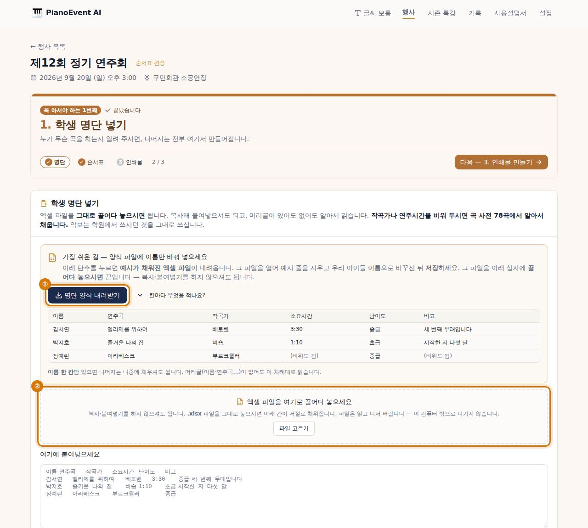
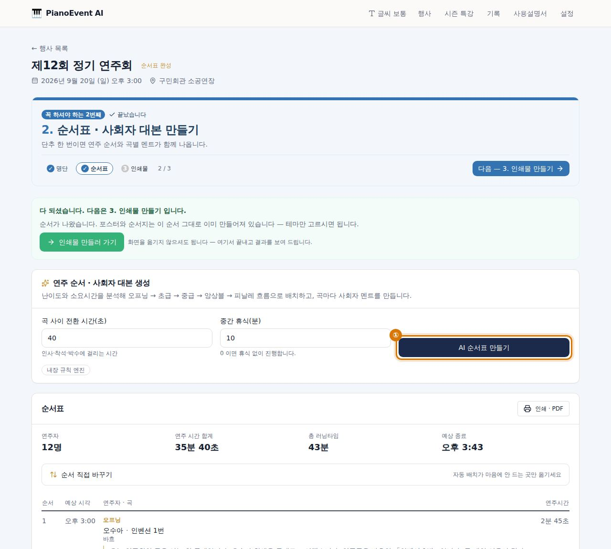
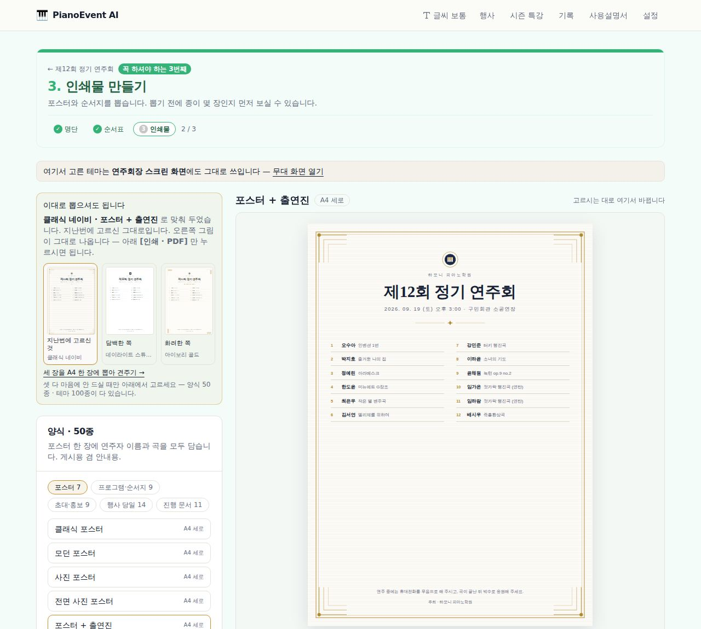
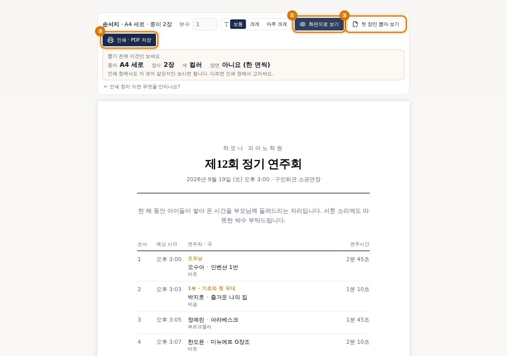
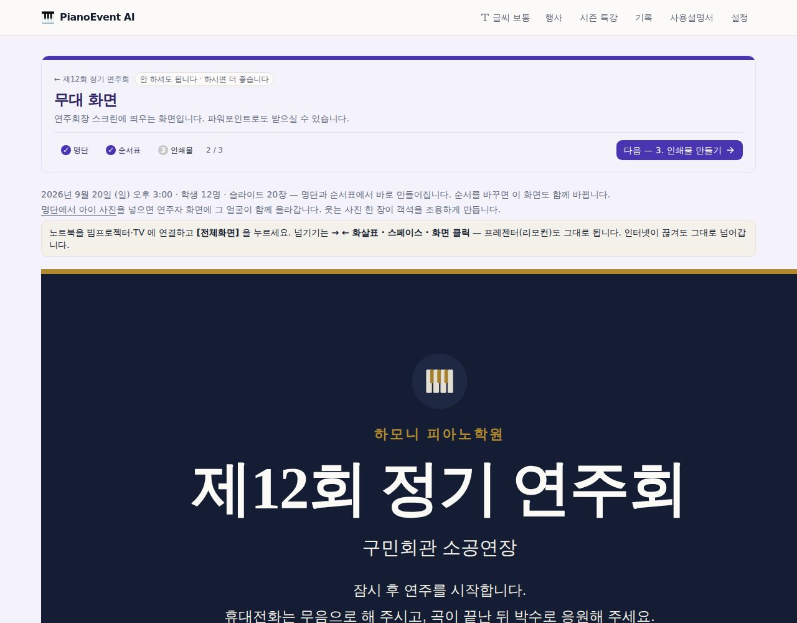
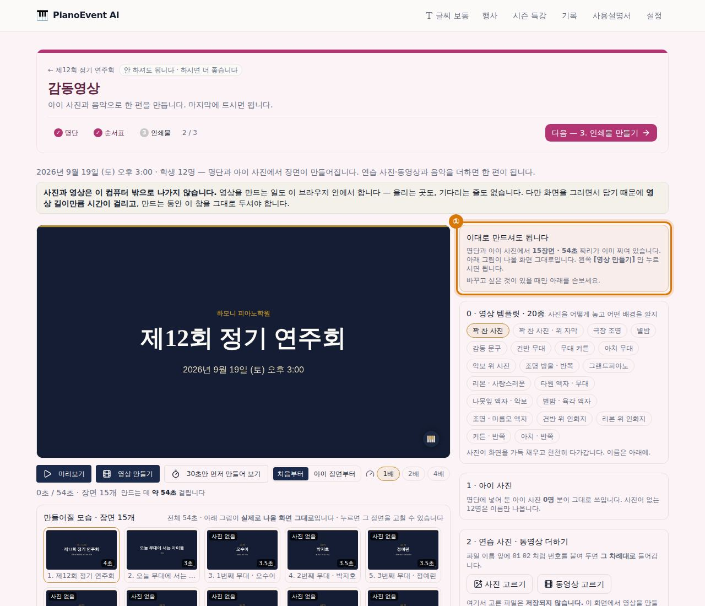
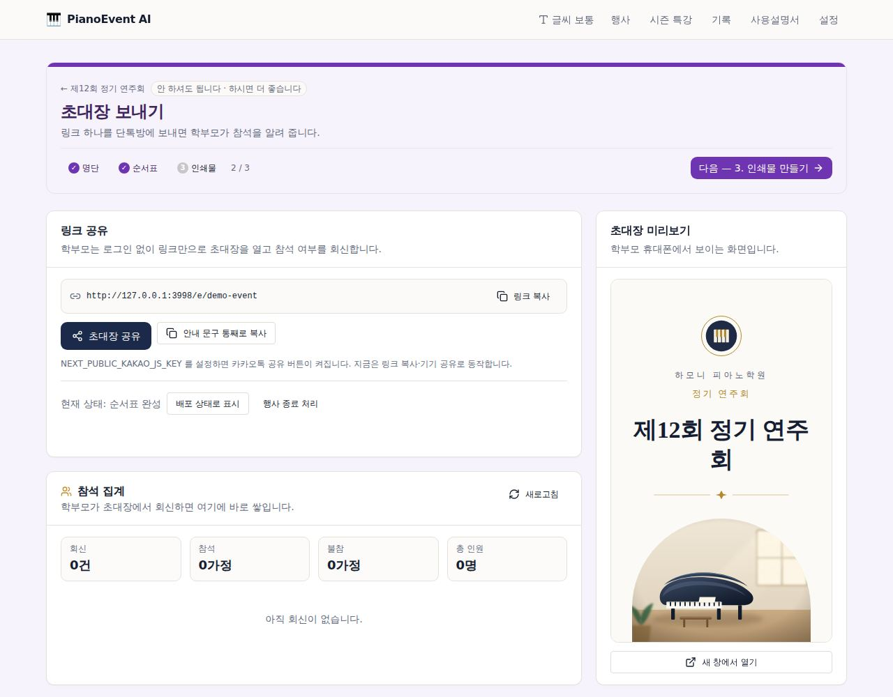
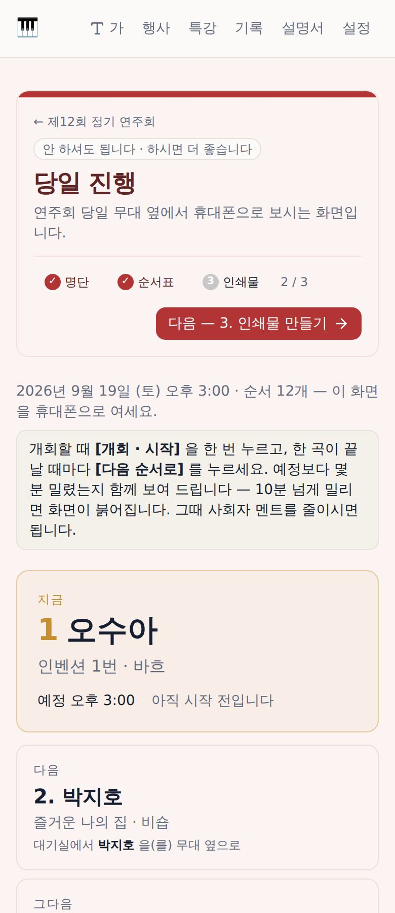
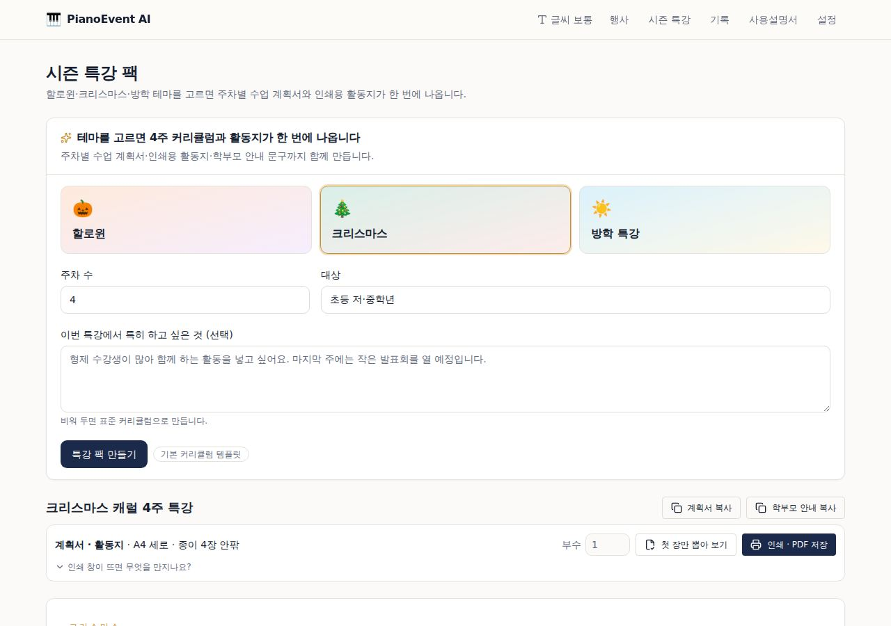
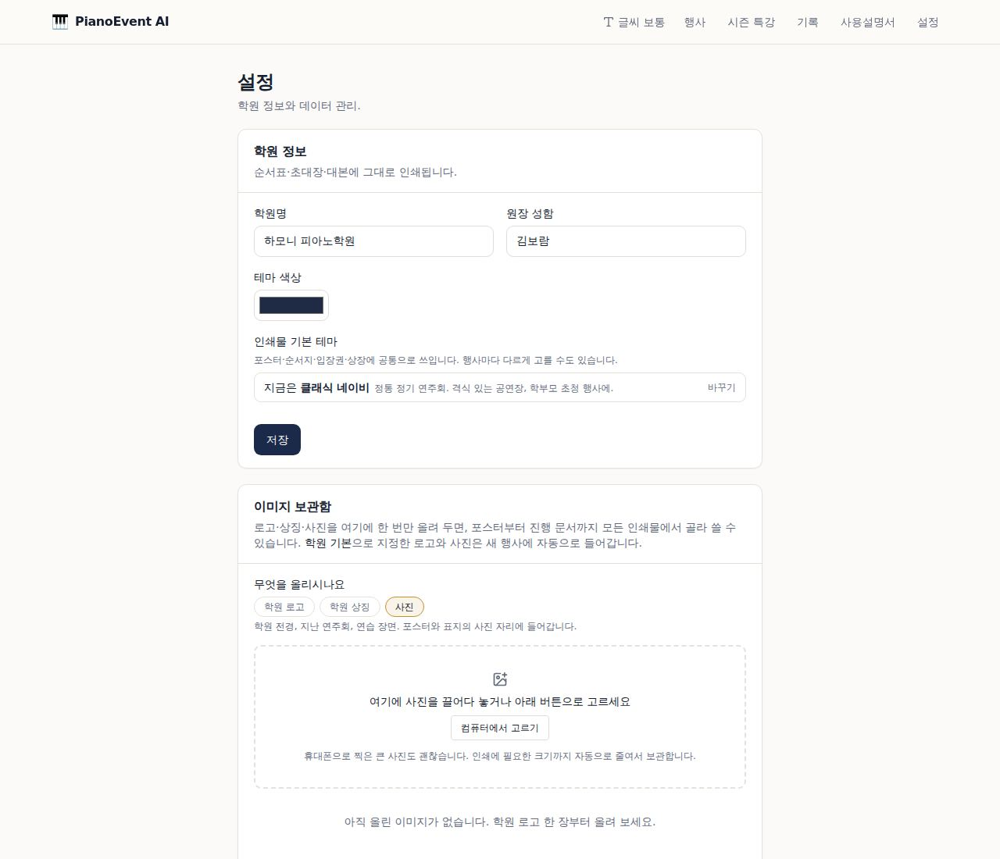

# PianoEvent AI 사용설명서

원장님이 처음 켠 순간부터 연주회를 마칠 때까지, 화면 순서 그대로 적었습니다.
컴퓨터가 익숙하지 않아도 됩니다. **누르는 곳만 따라오시면 됩니다.**

---

## 딱 세 가지만 하시면 됩니다

처음 여시면 무엇부터 할지 몰라 멈추게 됩니다. 이것만 순서대로 하세요. 나머지는 전부 **안 하셔도 됩니다.**

1. **학생 명단 넣기** — 행사 화면의 `학생 명단` 탭에서 **[명단 양식 내려받기]** 를 누르고,
   엑셀에서 예시 줄을 우리 아이들 이름으로 바꿔 저장한 뒤, **그 파일을 화면에 끌어다 놓으세요.**
   (복사·붙여넣기를 하지 않으셔도 됩니다.)
2. **[AI 순서표 만들기]** 한 번 — 순서와 사회자 멘트가 한 번에 나옵니다.
3. **[인쇄물 디자인]** 에서 포스터를 뽑고, **[초대장]** 링크를 단톡방에 보내세요.
   뽑기 전에 **[종이로 보기]** 로 몇 장인지 보시고, **[첫 장만 뽑아 보기]** 로 한 장만
   확인하신 뒤 나머지를 뽑으세요.

> 여기까지가 연주회 준비의 전부입니다. 무대 화면 · 감동영상 · 당일 진행 화면은
> **하시면 좋은 것**이지 하셔야 하는 것이 아닙니다.
>
> 화면 곳곳의 설정은 **그대로 두셔도 잘 나오게** 맞춰 두었습니다.
> 감동영상 화면의 `자세히 고치기` 처럼 접혀 있는 것은 손대지 않으셔도 됩니다.

> 설명서의 화면 그림에는 **누르실 자리에 주황색 동그라미와 번호**(① ② ③)가 쳐져 있습니다.
> 글보다 그림을 먼저 보셔도 됩니다.

### 화면이 알려 주는 세 가지

프로그램 화면은 원장님이 **묻지 않아도 알 수 있게** 만들어 두었습니다.

| 무엇을 | 어떻게 |
|---|---|
| **여기가 어디인가** | 화면마다 **바탕색이 다릅니다.** 명단은 주황, 순서표는 파랑, 인쇄물은 초록… 화면 맨 위에도 같은 색 띠가 있습니다 |
| **꼭 해야 하나** | 맨 위에 `꼭 하셔야 하는 1번째` 또는 `안 하셔도 됩니다` 라고 적혀 있습니다 |
| **어디까지 했나** | 맨 위에 `명단 · 순서표 · 인쇄물` 세 점이 있습니다. 끝난 것은 ✓ 로 바뀌고 `2 / 3` 처럼 셉니다 |
| **다음은 무엇인가** | 그 오른쪽에 **[다음 — 3. 인쇄물 만들기]** 단추가 늘 있습니다. 누르시면 그리로 갑니다 |

> 그러니 **길을 외우지 않으셔도 됩니다.** 다음 단추만 따라가시면 끝납니다.

### 글씨가 작으시면

머리띠 왼쪽 **[글씨 보통]** 을 누르세요. 누를 때마다 **보통 → 크게 → 아주 크게**
로 바뀌고, 한 번 더 누르면 처음으로 돌아옵니다.

- 고르신 크기는 **다음에 여실 때도 그대로**입니다.
- 화면 전체가 커지는 것이 아니라 **글씨만** 커집니다 — 표가 옆으로 넘치지 않습니다.

### 하시던 자리에서 다음 것까지

명단을 다 넣으시면 그 자리에 **[여기서 순서표 만들기]** 가 뜹니다. 누르시면
화면을 옮기지 않으셔도 순서표가 만들어지고, 끝나면 결과 화면으로 모셔다 드립니다.
순서표가 나오면 그다음은 **[인쇄물 만들러 가기]** 가 같은 자리에 뜹니다.

> 화면을 찾아 옮기는 것 자체가 부담입니다. 하시던 자리에서 끝내시면 됩니다.

**막히시면** 위쪽 `사용설명서` 를 누르세요. 이 글이 프로그램 안에서 그대로 열립니다.
그래도 막히시면 설명서 맨 아래 **[막히면 여기]** 에서 쪽지를 만들어 보내 주세요.

> 프로그램을 **처음 켜시면** 오른쪽 아래에 이 세 가지를 짚어 주는 작은 안내가 뜹니다.
> 화면을 가리지 않으니 보시면서 눌러 보셔도 됩니다. 한 번 닫으면 다시 뜨지 않습니다.

---

## 처음이라 아무것도 없으시면 — 구경용 행사 한 번 만들어 보세요

행사 목록이 비어 있으면 무엇을 눌러도 볼 것이 없습니다. 그래서 이 프로그램이 무엇을
해 주는지 못 보신 채 닫으시게 됩니다.

**[구경용 행사 만들기]** 를 한 번 누르세요.

- 아이 10명 · 연주곡 · 얼굴 사진 · 연주 순서까지 **다 채워진 행사**가 하나 생깁니다.
- 인쇄물 · 무대 화면 · 감동영상 · 당일 진행까지 그 자리에서 전부 눌러 보실 수 있습니다.
- 명단을 만드실 필요도, 사진을 넣으실 필요도 없습니다. 이미 다 들어 있습니다.
- 다 보셨으면 **그냥 지우시면 됩니다.** 이름에 「지우셔도 됩니다」라고 적어 두었습니다.

들어 있는 아이 이름은 지어낸 이름이고, 사진도 그려 넣은 그림입니다. 실제 아이가 아닙니다.

### 구경이 끝나면

구경용 행사를 여시면 맨 위에 **띠**가 하나 붙어 있습니다.

띠 안에 **「여기까지 보셨습니다 — 2 / 4」** 가 있습니다. 구경거리 넷(**인쇄물 · 무대 화면 ·
감동영상 · 당일 진행**) 중에서 아직 안 여신 것에 **「아직」** 이 붙습니다. 그것을 누르시면
그 화면으로 곧장 갑니다.

이 넷이 이 프로그램에서 가장 큰 것들입니다. 인쇄물만 보고 닫으시면 절반도 못 보신 것입니다.

> 무엇을 보셨는지는 **이 컴퓨터 안에만** 적힙니다. 어디로도 올라가지 않습니다.

그 아래 단추가 둘 있습니다.

| 단추 | 언제 누르나요 |
|---|---|
| **[이제 진짜 행사 만들기]** | 다 보셨고 마음에 드실 때. 새 행사 만드는 화면으로 곧장 갑니다 |
| **[구경 끝났습니다 — 이 행사 지우기]** | 목록을 깨끗이 하고 싶으실 때. **확인 문구를 치실 필요 없습니다** |

지우실 때 겁내지 않으셔도 됩니다. 지어낸 자료뿐이라 잃을 것이 없고, 지우신 뒤에도
**[구경용 행사 만들기]** 단추는 목록에 그대로 있어 언제든 다시 만드실 수 있습니다.

행사 목록에서는 구경용에 **「구경용」 표**가 붙습니다. 진짜 행사와 섞이지 않습니다.

> 목록이 비었을 때는 이 단추가 화면 한가운데에 크게 뜹니다.
> 행사를 이미 만드신 뒤에도 목록 아래에 계속 있으니, 언제든 다시 만들어 보셔도 됩니다.

---

## 시작하기 전에

- 준비물: **학생 명단** (이름 · 연주곡 · 작곡가 · 대략의 연주 시간 · 난이도)
  엑셀에 적어 두셨다면 그대로 씁니다. 없어도 화면에서 한 명씩 넣을 수 있습니다.
- 걸리는 시간: 명단이 있으면 **처음부터 인쇄까지 30분**이면 끝납니다.

---

## 0. 행사 목록 — 어느 것이 급한가요

**행사** 목록에서 행사마다 **점 세 개**가 보입니다. 켜진 점이 끝낸 단계입니다
(`2 / 3`, 셋 다 끝나면 `준비 끝`). 여러 행사를 함께 준비하실 때 어느 것이 급한지
한눈에 아십니다.

---

## 0-2. 행사 화면 — 무엇부터 하나요

행사를 여시면 **큰 카드 세 장**이 먼저 보입니다. 연주회 준비에 꼭 필요한 세 가지입니다.

- 지금 하실 차례인 카드 하나만 **테두리가 진하게** 표시됩니다. 그것만 누르시면 됩니다.
- 끝난 카드에는 **✓ 끝났습니다** 가 붙습니다.
- 그 아래 **[하시면 더 좋은 것 9가지]** 는 접혀 있습니다 — 초대장 · 무대 화면 · 감동영상 …
  **안 하셔도 연주회는 됩니다.** 여유가 있으실 때 펴 보세요.
- 곁들이도 **해 두신 것에는 ✓ 와 "해 두셨습니다"** 가 붙습니다. 해 놓고 또 들어가
  보실 일이 없습니다.

> 예전에는 이 화면에 갈 곳이 열한 군데였고 크기도 색도 다 같았습니다.
> 무엇이 중요한지 알 수 없어 아무것도 못 고르시는 것이 당연했습니다.

---

## 1. 행사 만들기

1. 위쪽 **행사** → 오른쪽 **새 행사** 를 누릅니다.
2. 정기 연주회인지 시즌 특강인지 고르고, 행사명·날짜·장소를 넣습니다.
3. **원장 인사말**은 지금 비워 두셔도 됩니다. 나중에 언제든 고칠 수 있고,
   초대장과 프로그램 표지에 그대로 실립니다.
4. **행사 만들기** 를 누르면 끝입니다.

> 행사 화면 맨 위에 **① 명단 → ② 순서표·대본 → ③ 인쇄물·초대장** 세 단계가 보입니다.
> 끝난 단계는 표시되고, 세 개가 다 끝나면 안내가 사라집니다. 순서대로만 하시면 됩니다.

---

## 2. 학생 명단 넣기 — ①



### 명단 양식 내려받기 (가장 쉽습니다)

`학생 명단` 탭 맨 위 **[명단 양식 내려받기]** 를 누르면 예시가 채워진 파일이 내려옵니다.

1. 그 파일을 **엑셀**(또는 구글시트)에서 엽니다.
2. 예시 세 줄을 지우고 **우리 아이들 이름**으로 바꾼 뒤 **저장**합니다.
3. 그 파일을 프로그램의 **[엑셀 파일을 여기로 끌어다 놓으세요]** 상자에 끌어다 놓습니다.
   (끌어다 놓는 것이 어려우시면 **[파일 고르기]** 를 누르셔도 같습니다.)
4. "이렇게 읽었습니다" 를 한 번 보시고 **[명단에 추가]**.

> **복사·붙여넣기를 하지 않으셔도 됩니다.** 파일을 그대로 놓으시면 됩니다.
> 파일은 읽고 나서 버립니다 — 이 컴퓨터 밖으로 나가지 않습니다.

| 칸 | 무엇을 적나요 | 비우면 |
|---|---|---|
| **이름** | 아이 이름. **이 칸만 꼭 필요합니다** | 그 줄은 건너뜁니다 |
| 연주곡 | 곡 제목. 아시는 대로 | 나중에 표에서 채우셔도 됩니다 |
| 작곡가 | 곡을 쓴 사람 | 곡 사전에 있는 곡이면 알아서 채웁니다 |
| 소요시간 | `3:30` `3분30초` `210` 전부 됩니다 | 난이도로 어림잡습니다 |
| 난이도 | 초급 · 중급 · 고급 · 듀엣 | 초급으로 봅니다 |
| 비고 | 아이의 한 줄 이야기 | 멘트가 조금 담백해집니다 |

> **난이도 칸에 적을 수 있는 말** — 초급(기초·입문) / 중급 / 고급(상급·심화) / 듀엣(앙상블·연탄·합주).
> 화면에 적힌 말은 전부 실제로 읽힙니다.

**자주 하는 실수**

| 이렇게 하시면 안 됩니다 | 왜 |
|---|---|
| 한 칸에 `김서연 엘리제를 위하여` | 이름과 곡은 **다른 칸**이어야 합니다 |
| 맨 윗줄에 `1학년 3반` 같은 제목 | 머리글은 이름·연주곡… 한 줄만 두세요 |
| 소요시간에 `3분 정도` | `3:30` 이나 `210` 처럼 숫자로. 비워 두셔도 됩니다 |

> 사이사이 **빈 줄은 괜찮습니다.** 그냥 건너뜁니다.

### 이미 갖고 계신 엑셀 파일이 있다면

명단을 이미 엑셀로 갖고 계시면 **양식을 내려받지 않으셔도 됩니다.** 그 파일을 그대로
끌어다 놓으세요. 열 순서가 달라도 제목 줄(이름·연주곡·작곡가…)을 보고 알아서 맞춥니다.

- **.xlsx** 파일이면 됩니다. 옛날 **.xls** 파일이면 엑셀에서 [다른 이름으로 저장] →
  "Excel 통합 문서(.xlsx)" 로 한 번 저장한 뒤 놓으세요. 화면이 그렇게 알려 드립니다.
- 엑셀에서 `3:30` 이라고 치시면 엑셀은 그것을 속으로 시간으로 바꿔 둡니다.
  프로그램이 알아서 `3:30` 으로 되돌립니다.

### 학년별로 장(시트)을 나눠 두셨다면

엑셀 아래쪽에 `1학년` `2학년` 처럼 탭이 여러 개 있는 파일이 있습니다.

파일을 놓으시면 **맨 앞 장**을 먼저 읽고, 장이 둘 이상이면 아래에 **장 이름 단추**가
나옵니다. 원하시는 장을 누르면 그 장으로 다시 읽습니다. 장이 하나뿐인 파일에서는
이 단추가 아예 나오지 않습니다 — 고르실 것이 없으니까요.

> 학년별로 나뉜 명단을 다 넣으시려면, 장을 하나씩 골라 **[명단에 추가]** 를 누르시면 됩니다.
> (교체가 아니라 추가입니다. 앞서 넣은 학년이 지워지지 않습니다.)

### 복사해서 붙여넣기 (이 길도 그대로 있습니다)

1. 엑셀·구글시트에서 이름·연주곡이 있는 **표 부분을 드래그해 복사**(Ctrl+C)합니다.
2. **학생 명단** 탭의 큰 네모 칸에 **붙여넣기**(Ctrl+V)합니다.
3. 아래 "이렇게 읽었습니다" 를 보시고 **명단에 추가** 를 누릅니다.

- 시간은 `3:20`, `3분 20초`, `200`(초) 어떻게 적으셔도 읽습니다.
- 못 읽은 줄은 **몇 번째 줄인지 알려 드립니다.** 그 줄만 고치시면 됩니다.
- 어떻게 붙여넣는지 모르겠으면 **예시 채우기** 를 눌러 모양을 보세요.

### "이렇게 읽었습니다" — 넣기 전에 한 번 보세요

붙여넣거나 파일을 놓으시면, **넣기 전에** 프로그램이 읽은 결과를 사람 말로 알려 드립니다.

- 아이 몇 명 · 무대 몇 번인지 (한 아이가 두 곡이면 사람 수와 무대 수를 따로 셉니다)
- 머리글을 건너뛰었는지, 아니면 왼쪽부터 차례로 읽었는지
- 연주곡이 빈 아이가 누구인지
- 곡 사전이 무엇을 대신 채웠는지
- **이름과 곡이 한 칸에 붙어 있는지** (가장 흔한 실수입니다)
- **같은 아이가 같은 곡으로 두 번** 들어갔는지 (붙여넣기를 두 번 하신 경우입니다)
- 한 아이가 무대에 세 번 넘게 오르는지

> 곡이 **다르면** 같은 아이가 두 줄이어도 잘못이 아닙니다 — 독주와 듀엣을 함께
> 맡는 아이는 흔합니다. 그런 줄은 짚지 않습니다.

⚠ 표시가 하나도 없으면 그대로 넣으셔도 됩니다.

### 되돌리기 — 잘못 넣으셨어도 괜찮습니다

**[명단에 추가]** 나 **[기존 명단 교체]** 를 누르신 뒤에 **[되돌리기]** 가 나타납니다.
누르시면 **붙여넣기 직전 그대로** 돌아갑니다 — 아이 사진까지 그대로입니다.

> 교체로 넣으셔서 원래 명단이 지워졌더라도 되돌아갑니다.
> 그러니 겁내지 마시고 눌러 보셔도 됩니다.

### 되돌리기는 화면 맨 위 한 자리에만 있습니다

무엇을 하시든 **화면 맨 위**에 한 줄이 뜹니다. 되돌리기는 거기 하나뿐입니다 —
자리마다 있으면 자리마다 새로 배우셔야 하니까요.

> 방금 하신 것 — **김서연 · 연주곡** (소나티네 → 엘리제를 위하여)  **[되돌리기]**

여기서 되돌아가는 것

| 무엇을 하셨을 때 | 되돌리면 |
|---|---|
| 명단 붙여넣기 · 교체 | 붙여넣기 직전 그대로 (사진까지) |
| 표의 칸 고치기 | 고치기 전 값으로 |
| 연주 순서 바꿔 저장 | 저장 전 순서로 |

- 무엇을 무엇으로 되돌리는지 **미리 보여 드립니다.** 누르기 전에 확인하세요.
- **열 번까지** 거슬러 올라갑니다. 단추 옆 숫자가 남은 횟수입니다.
- 사진처럼 한 번에 두 칸이 바뀌는 것은 **함께** 되돌아갑니다.
- **다른 화면에 갔다 오셔도 남아 있습니다.** 명단을 고치고 인쇄물을 보러 가셨다가
  "아까 그거 잘못 고쳤는데" 하고 돌아오셔도 그대로 되돌리실 수 있습니다.
- 다만 **다른 행사**의 것은 보이지 않고, 30분이 지나면 스스로 사라집니다 —
  어제 하신 일을 오늘 되돌리면 놀라시니까요.

### 한 명씩 넣기

아래 **한 명 직접 추가** 에서 이름·곡·난이도를 넣고 **추가** 를 누릅니다.

### 고치기

표의 칸을 누르면 바로 고쳐집니다. 다 고친 뒤 다른 곳을 누르면 저장됩니다.
지우려면 줄 오른쪽 **휴지통** 을 누릅니다.

> **특징 메모** 칸이 사회자 멘트의 재료가 됩니다.
> "올해 처음 무대에 섭니다", "동생과 함께 연주합니다" 처럼 한 줄만 적어 두세요.
> 이 한 줄이 대본의 온도를 바꿉니다.

### 한 아이가 여러 곡을 맡을 때

독주도 하고 듀엣도 하는 아이가 있습니다. 순서표에서는 **두 줄이 맞습니다** — 무대에 두 번 오르니까요.
이름과 사진을 다시 치실 필요는 없습니다.

줄 오른쪽 **곡 추가**(&#8853;) 를 누르면 **이름 · 난이도 · 사진은 그대로**인 줄이 하나 더 생깁니다.
곡명만 채우시면 됩니다. 그 아이의 줄에는 **"2곡 중 1번째"** 라고 표시되므로 같은 이름이 두 번
보이는 이유가 한눈에 보입니다.

| 어디에 어떻게 나오나 | |
|---|---|
| **순서표 · 인쇄물 · 무대 화면** | 두 줄 그대로 — 두 번 무대에 오르니까요 |
| **감동영상** | **한 장면으로 묶입니다.** 같은 얼굴이 두 번 지나가지 않고, 맡은 곡을 함께 적습니다 |
| **연주자 수** | 명단 위에 **"연주자 12명 · 13곡"** 처럼 사람 수와 곡 수를 따로 셉니다 |

---

### 지난 행사에서 명단 가져오기 (가장 빠릅니다)

작년에도 이 프로그램으로 하셨다면 명단을 다시 치지 마세요.

1. 학생 명단 탭 맨 위의 **지난 행사에서 명단 가져오기**
2. 어느 행사에서 가져올지 고릅니다
3. **가져오기**

이름과 난이도가 그대로 옵니다. **곡만 채우시면 됩니다.**
연주곡까지 같으면 `연주곡까지 그대로 가져오기` 를 체크하세요.

> 지금 명단이 있으면 지우고 바꿉니다. 확인 창이 한 번 뜹니다.
>
> **아이 사진도 함께 따라옵니다.** 보관함은 학원 것이고 아이도 그 아이입니다 —
> 30명 얼굴을 해마다 다시 짝지을 이유가 없습니다. 그 사이 보관함에서 지우신 사진만 빠집니다.

---

### 곡 사전이 대신 채웁니다

**작곡가와 연주시간을 모르셔도 됩니다.** 곡 제목만 적으시면 됩니다.

- 붙여넣기든 직접 추가든, 비어 있는 **작곡가 · 난이도 · 연주시간**을 곡 사전 78곡에서 채웁니다
- 직접 추가할 때는 곡 제목을 몇 글자만 쳐도 **후보 목록**이 뜹니다. 골라 누르면 나머지가 한 번에 들어갑니다
- 원장님이 적으신 값은 **절대 덮어쓰지 않습니다.** 편곡본이나 발췌 연주라면 그대로 적으세요

> 사전에 없는 곡도 그냥 적으시면 됩니다. 난이도로 시간을 추정합니다.

---

## 3. 순서표와 사회자 대본 만들기 — ②



1. **순서표 · 대본** 탭으로 갑니다.
2. **AI 순서표 만들기** 를 누릅니다. (몇 초 걸립니다)
3. 아래에 순서표가 나옵니다. 곡마다 **사회자 멘트**가 함께 붙어 있습니다.

### 순서는 이렇게 정해집니다

오프닝(짧고 안정적인 중급) → 기초·초급 → 중급 → 듀엣·앙상블 → 피날레(가장 어려운 곡)

같은 작곡가나 같은 학생이 연달아 나오지 않도록 자리를 바꿔 줍니다.

### 시간 계산

- 곡 사이 **전환 시간**(인사·착석·박수)은 기본 40초입니다. 학원 사정에 맞게 바꾸세요.
- 50분이 넘어가면 **중간 휴식 10분**이 자동으로 들어갑니다. 필요 없으면 0으로 두세요.
- 위쪽에 **연주자 수 · 연주 시간 합계 · 총 러닝타임 · 예상 종료 시각**이 나옵니다.

### 확인이 필요한 부분

빨간 상자로 알려 드립니다. 예를 들면

- 러닝타임이 100분을 넘을 때 → 곡을 줄이거나 1·2부로 나누세요
- 한 학생이 3번 이상 무대에 오를 때
- 같은 학생이 연달아 두 곡을 칠 때
- 10분이 넘는 곡 → 발췌 연주를 검토하세요

### 대본만 따로 보기

위쪽 **사회자 대본** 을 누르면 오프닝 → 곡별 멘트 → 클로징이 순서대로 나옵니다.
**전체 대본 복사** 로 한글 문서에 붙여넣거나, **대본 인쇄** 로 바로 뽑으세요.

> AI 키가 없어도 됩니다. 없으면 내장 규칙 엔진이 만들고, 화면에 어느 쪽으로 만들어졌는지
> 표시됩니다. 결과는 어느 쪽이든 그대로 쓰실 수 있습니다.

---

### 자동 순서가 마음에 안 들 때

순서표 아래 **[순서 직접 바꾸기]** 를 누르세요.

1. 옮기고 싶은 학생의 **▲ ▼ 버튼**을 누릅니다 (마우스로 끌 필요 없습니다)
2. **[이 순서로 저장]**

저장하면 **연주 시각이 다시 계산되고 인쇄물 50종이 함께 바뀝니다.**
사회자 멘트는 그대로 남습니다.

> 마음에 안 들면 **[되돌리기]** 로 저장 전 상태로 돌아갑니다.

---

## 4. 인쇄물 만들기 — ③



행사 화면 위쪽 **인쇄물 디자인** 을 누릅니다.

### 아무것도 안 고르셔도 됩니다 — 이미 골라 두었습니다

디자인 화면을 여시면 맨 위에 **「이대로 뽑으셔도 됩니다」** 가 먼저 보입니다.

- 양식과 테마가 **이미 하나로 맞춰진 채** 열립니다. 오른쪽 미리보기가 그대로 나옵니다.
- 행사 **달에 맞춰** 골라 둡니다. 3월이면 벚꽃, 12월이면 눈꽃입니다. 왜 그걸 골랐는지도
  한 줄로 적혀 있습니다.
- 지난번에 이미 고르신 것이 있으면 **그것을 그대로** 씁니다. 두 번 고르실 일이 없습니다.
- 아래 **[인쇄 · PDF]** 만 누르시면 끝입니다.

그 아래에 **작은 그림 세 장**이 나란히 있습니다. 마음에 안 드실 때 100종을 뒤지지 않으시게,
딴 길 둘을 미리 세워 둔 것입니다.

| 자리 | 무엇 |
|---|---|
| 첫째 | **이대로 하시면 됩니다** — 행사 달에 맞춰 골라 둔 것 (지난번에 고르신 것이 있으면 그것) |
| 둘째 | **담백한 쪽** — 장식을 덜고 글씨와 사진을 크게 |
| 셋째 | **화려한 쪽** — 금선과 장식이 들어간 정통 연주회 느낌 |

**세 장 다 실제로 뽑힐 그림**입니다. 색 동그라미가 아니라 진짜 인쇄물을 줄여 놓은 것이라,
보시는 그대로 나옵니다. 하나를 누르시면 오른쪽 큰 그림이 그 자리에서 바뀝니다.

자리 셋은 늘 같습니다 — 첫째가 권하는 것, 둘째가 담백, 셋째가 화려. 매번 자리가 바뀌면
"아까 그건 어디 갔지" 가 되기 때문입니다.

#### 종이로 견주기 — A4 한 장

**화면 색과 종이 색은 다릅니다.** 화면에서 곱던 금색이 종이에서는 누렇게 나오고,
옅은 하늘색은 아예 안 나오기도 합니다. 화면만 보고 100부를 걸면 그때 아십니다.

세 장 아래 **[세 장을 A4 한 장에 뽑아 견주기]** 를 누르세요.

- **A4 가로 한 장**에 셋이 나란히 나옵니다. 견주려고 세 장을 뽑는 것이 아닙니다.
- 각 그림 옆에 **동그라미 칠 자리**가 있습니다. 종이에 표시하고 그것을 화면에서 고르시면 됩니다.
- 원장님 혼자 정하기 어려우실 때 **선생님들께 돌려 보시기**에도 좋습니다.

**셋 다 마음에 안 드실 때만** 아래를 손보세요. 아래 설명은 그때 읽으시면 됩니다.

> 고를 것이 150가지(양식 50 × 테마 100)라는 사실 자체가 걸림돌이었습니다.
> 이제는 「고르기」가 아니라 「마음에 안 들면 바꾸기」입니다.

### 왼쪽에서 고르기

- **양식 50종** — 위쪽 갈래(포스터 · 프로그램 · 초대·홍보 · 행사 당일 · 진행 문서)를 먼저 누르면
  그 갈래의 양식만 보입니다.
- **테마 100종** — 성격 묶음을 먼저 고르세요.

  | 묶음 | 이런 학원에 |
  |---|---|
  | 고급 · 클래식 (32) | 정통 정기 연주회, 격식 있는 홀. 금선·아치·진주 장식 |
  | 사랑스러운 (20) | 유아·초등 학부모 초청. 하트·리본·꽃 |
  | 계절 · 시즌 (26) | 봄 벚꽃, 여름 마린, 가을 단풍, 겨울 눈꽃, 새해, 졸업 |
  | 모던 · 편집 (14) | 사진과 큰 글씨가 주인공 |
  | 아이들 · 활기 (8) | 놀이형 미니 콘서트 |

  100종이라 목록만으로는 못 고릅니다. **테마 찾기** 상자에 `봄` `금색` `아이` `격식` 처럼
  적으면 걸리는 것만 나옵니다.

  맨 위 **이 시기에 어울리는 테마** 에는 행사 달에 맞는 것이 먼저 나옵니다. 3월이면 벚꽃,
  12월이면 눈꽃·크리스마스가 뜹니다. 여기서 고르면 대부분 끝납니다.
- **문구** — 부제·주최·문의·관람 안내를 고칩니다.

> **미리보기는 화면에 붙어 따라옵니다.** 테마나 색을 고르러 아래로 내려가셔도
> 미리보기가 위쪽에 그대로 남아 있어, 누르는 즉시 무엇이 바뀌었는지 보실 수 있습니다.
> (예전에는 미리보기가 화면 위로 사라져 색을 눌러도 확인할 수가 없었습니다.)
- **이미지** — 보관함에 올려 둔 로고와 사진 중에서 고릅니다. 고르는 즉시 오른쪽 미리보기가 바뀝니다.

### 지난 행사에서 디자인 가져오기

학원은 해마다 같은 얼굴입니다. 작년에 맞춰 두신 디자인을 다시 고르실 이유가 없습니다.

디자인 화면 맨 위 **지난 행사에서 디자인 가져오기** 에서 행사를 고르고 **[가져오기]**.

| 따라오는 것 | |
|---|---|
| **테마 · 양식** | 작년에 고르신 그대로 |
| **문구** | 부제 · 주최 · 문의 · 안내 (체크를 끄면 안 가져옵니다) |
| **사진 지정** | 포스터엔 단체사진, 표지엔 학원 전경처럼 지정해 두신 것. 그 사이 보관함에서 지운 사진은 건너뜁니다 |
| **무대 화면 · 영상 설정** | 저장해 두셨다면 함께 |

> 행사 이름과 날짜는 따라오지 않습니다 — 그건 이번 행사의 것이니까요.

### 인쇄하기 — 뽑기 전에 종이부터 세어 보세요



1. 오른쪽 위 **인쇄 · PDF** 를 누릅니다. 새 창이 열립니다.
2. 창 맨 위 띠에 **종이 몇 장**이 나오는지 적혀 있습니다.
   **부수**를 넣으시면 총 몇 장인지도 알려 드립니다 — 100부를 뽑기 전에 보세요.
3. **[종이로 보기]** 를 누르면 화면이 **종이 모양 그대로** 바뀝니다.
   두 장을 넘어가면 **잘리는 자리에 빨간 점선**이 그어집니다. 거기서 다음 장으로 넘어갑니다.
4. **[첫 장만 뽑아 보기]** 로 한 장만 뽑아 확인하세요.
5. 맞으면 **[인쇄 · PDF 저장]** 으로 나머지를 뽑습니다.

> **왜 한 장 먼저 뽑나요?** 배율·여백·배경 그래픽 셋 중 하나만 틀려도 종이를 버립니다.
> 100부를 걸기 전에 한 장이면 압니다. **종이 한 장이 100장을 살립니다.**

### 뽑기 전에 이것만 보세요 — 마지막 확인 넷

인쇄 띠 아래에 **큰 글씨로 넷**이 적혀 있습니다.

| | 무슨 뜻인가요 |
|---|---|
| **종이** | `A4 세로` 처럼. 인쇄 창의 용지도 이것과 같아야 합니다 |
| **장수** | 지금 인원으로 실제로 세어 본 장수. 부수를 넣으시면 `12장 × 100부 = 1,200장` 으로 |
| **색** | 보통은 `컬러`. 글만 있는 진행 문서는 흑백으로 뽑으셔도 된다고 적어 드립니다 |
| **양면** | 보통은 `아니요 (한 면씩)`. 책자만 `예 · 짧은 쪽 넘기기` |

많이 뽑으실 때는 **종이가 얼마나 드는지**도 함께 적어 드립니다 — `A4 2.4연(한 연 500장)입니다.
프린터에 그만큼 있는지 먼저 보세요.` 「1,200장」은 숫자일 뿐이라 크기가 안 그려지지만,
「연」과 「박스」로 말씀드리면 그 자리에서 아십니다.

한 박스(2,500장)를 넘으면 **인쇄소를 알아보시라고** 말씀드립니다. 학원 프린터로는 벅찹니다 —
잉크도, 시간도, 프린터 수명도.

인쇄 창이 뜨면 **이 넷만 같은지** 보시면 됩니다. 다르면 인쇄 창에서 고치세요.
브라우저 인쇄 창은 우리가 만든 것이 아니라 낱말이 조금씩 다른데, 이 넷은 어느 브라우저에나
있습니다.

### 인쇄 창이 뜨면 무엇을 만지나요?

인쇄 띠의 **[인쇄 창이 뜨면 무엇을 만지나요?]** 를 누르면 화면에도 나옵니다.

| 어디 | 어떻게 |
|---|---|
| **대상 (프린터)** | 종이로 뽑으시려면 프린터를, 파일로 두시려면 `PDF로 저장` |
| **배율** | `100%` 또는 `기본값`. **"용지에 맞춤" 으로 두면 여백이 크게 남습니다** |
| **여백** | `없음`. 여백은 디자인 안에 이미 잡혀 있습니다 |
| **배경 그래픽** | **켜 주세요.** 이걸 끄면 색과 무늬가 하나도 안 나옵니다 (더보기 안에 있습니다) |

> 브라우저마다 낱말이 조금씩 다릅니다. 없으면 **더보기**(고급 설정) 안을 보세요.
> 셋 중 하나만 틀려도 종이를 버리게 됩니다. 첫 장은 **한 장만** 뽑아 보시길 권합니다.

### 책자는 양면으로 뽑으셔야 합니다

**책자 한 벌**(겉장 · 속장)은 반 접어 쓰는 것이라 **양면**으로 뽑으셔야 합니다.

1. 인쇄 창에서 **"양면 인쇄"** 를 켭니다.
2. **"짧은 쪽 넘기기"** 를 고릅니다.
3. 뽑으신 뒤 **반으로 접으면** A5 책자가 됩니다.

> **"긴 쪽 넘기기" 로 두면 뒷장이 거꾸로 찍혀** 접었을 때 속장이 뒤집힙니다.
> 다 뽑고 접어 보신 뒤에야 아시게 되니, 화면의 안내를 한 번 보고 뽑으세요.
> 책자를 고르시면 이 안내가 인쇄 띠에 저절로 뜹니다.

### 종이 위 글씨가 작으시면

순서표 인쇄·사회자 대본·견적 요약 화면의 인쇄 띠에 **[보통 · 크게 · 아주 크게]** 가
있습니다. 종이에 찍히는 글씨가 커집니다.

- 키우면 줄이 늘어 **장수가 늘 수 있습니다.** 몇 장이 되는지 그 자리에서 다시 세어
  보여 드리니 뽑기 전에 아십니다.
- 화면 글씨(머리띠의 [글씨 보통])와 **따로** 입니다. 화면은 크게, 종이는 보통으로 두셔도 됩니다.

### 인쇄소·현수막 업체에 맡기실 때

집 프린터가 아니라 인쇄소에 맡기시면 **인쇄물 화면 위쪽**의
**[인쇄소용 (재단선 · 여백 3mm)]** 을 누르세요. 그다음 **[인쇄 · PDF 저장]** 으로
PDF 를 만들어 그대로 넘기시면 됩니다.

무엇이 달라지느냐면

| | |
|---|---|
| **물림 여백 3mm** | 사방으로 3mm 를 더 그립니다. 그 부분은 잘려 나갑니다 |
| **재단선** | 네 모서리에 자를 자리를 표시합니다 |

인쇄소는 종이를 크게 뽑아 잘라 냅니다. 자르는 자리가 종이마다 1~2mm 씩 어긋나기
때문에, 가장자리까지 색이 찬 디자인은 여유를 더 두어야 **가장자리가 하얗게 뜨지
않습니다.** 이 낱말들을 아셔야 할 이유는 없습니다 — 단추 한 번이면 됩니다.

> 집 프린터로 뽑으실 때는 **누르지 마세요.** 종이가 커져서 오히려 줄어들어 나옵니다.
> 눌렀다가 **[집 프린터용으로]** 로 되돌리실 수 있습니다.

### 인쇄소에 전화하실 때 — 견적용 요약 한 장

인쇄소는 전화를 받으면 이렇게 묻습니다. **"몇 절이요? 종이는요? 몇 부요?"**
그 낱말을 모르시면 전화를 못 거십니다. 그래서 답을 미리 적어 두었습니다.

인쇄물 화면 위쪽 **[인쇄소 견적용 요약]** 을 누르면 종이 한 장이 나옵니다.

| 적혀 있는 것 | |
|---|---|
| **인쇄물 이름** | 클래식 포스터 · 프로그램 표지 … |
| **규격** | `A4 세로 (210 × 297mm)` — 인쇄소는 mm 로 말합니다 |
| **종이** | `스노우지 200g` 처럼 연주회 인쇄물에 흔히 쓰는 것 |
| **부수 · 총 장수** | 인쇄소가 가장 먼저 묻는 것입니다 |
| **함께 말씀하실 것** | PDF · 재단선 · 단면 컬러 · 받으실 날짜 |

- 이 종이를 **인쇄해서 들고** 전화하시거나, **[문자로 보낼 글 복사]** 로 복사해
  인쇄소에 문자로 보내셔도 됩니다.
- 종이 이름과 두께는 **권해 드리는 것**입니다. 인쇄소에서 다른 것을 권하면 그쪽이 맞습니다.

### 어디에서 인쇄할 수 있나요

| 무엇 | 어디 | 종이 미리보기 |
|---|---|---|
| 포스터 · 프로그램 · 순서지 등 50종 | 인쇄물 디자인 → **인쇄 · PDF** | 화면이 곧 종이입니다 |
| 순서지 (표만) | 순서표 · 대본 → **순서표 인쇄** | **[종이로 보기]** |
| 사회자 대본 | 행사 위쪽 **사회자 대본** | **[종이로 보기]** |
| 무대 화면 슬라이드 | 무대 화면 → **PDF로 저장** | 화면이 곧 슬라이드입니다 |
| 시즌 특강 계획서 · 활동지 | 시즌 특강 → **인쇄 · PDF 저장** | 계획서 한 장 + 활동지 |
| 이 사용설명서 | 사용설명서 → **설명서 전체 인쇄** | 절마다 새 장 |

### 한 벌 인쇄 (권장)

양식을 하나씩 고르기 번거로우면 왼쪽 **한 벌 인쇄** 를 쓰세요.

각 한 벌 이름 옆에 **「종이 N장」** 이 적혀 있습니다. 지금 명단 인원으로 계산한 실제 장수입니다.
눌러 들어가 보시기 전에, 고르시는 자리에서 바로 아십니다.

- **책자 한 벌** — 겉장 · 속장. **양면**으로 뽑아 반 접으면 A5 책자가 됩니다
- **접수·배부 한 벌** — 입장권 4매 · 좌석권 6매 · 감사 책갈피
- **무대 뒤 한 벌** — 무대 순서 카드 · 연주자 이름표
- **손님 배려 한 벌** — 큰 글씨 순서지 · 메모 칸 순서지
- **관객용 한 벌** — 포스터 · 프로그램 표지 · 순서지 · 입장권
- **당일 운영 한 벌** — 진행표 · 준비 체크리스트 · 좌석 이름표
- **안내문 한 벌** — 학부모 안내문 · 학생 준비 안내문 · 리허설 시간표
- **사회자 한 벌** — 사회자 대본 · 당일 진행표 · 시상 명단
- **접수처 한 벌** — 좌석 배치도 · 포토존 보드 (A4 가로)

### 새로 들어간 양식들

| 양식 | 이럴 때 씁니다 |
|---|---|
| 곡 해설 순서지 | 관객이 모르는 곡을 알고 듣게 하고 싶을 때 |
| 3단 접지 프로그램 | A4 한 장으로 작은 책자를 만들고 싶을 때 |
| 초대장 카드 2매 | 단톡방 말고 손으로 건네고 싶을 때 |
| SNS 세로 스토리 | 인스타그램·카카오 스토리에 올릴 때 |
| X배너 시안 | 입구에 세울 배너를 인쇄소에 넘길 때 |
| 좌석 배치도 | 접수처 벽에 붙여 좌석 안내를 끝낼 때 |
| 대기 순서판 | 무대 뒤에서 "다음 누구!" 를 그만 외치고 싶을 때 |
| 포토존 보드 | 사진에 학원 이름과 날짜를 남기고 싶을 때 |
| 시상 명단 | 시상 시간이 늘어지지 않게 |
| 사회자 대본 | 무대 옆은 어둡습니다. 큰 글씨로 인쇄해서 손에 쥐어 주세요 |
| 리허설 시간표 | 조별 소집 시각을 그대로 붙여 놓을 때 |
| 접수 확인표 | 도착 체크·좌석 안내·참가비를 한 장으로 |
| 예산·정산표 | 원장님·회계 담당이 함께 볼 때 |
| 학부모 안내문 | 같은 질문을 스무 번 받지 않기 위해 |
| 학생 준비 안내문 | 아이가 들고 가서 냉장고에 붙이는 종이 |
| 무대 배치도 | 대관처에 "피아노를 어디 놓아 주세요"를 종이로 |
| 가로 현수막 시안 | 무대 뒤에 거는 현수막을 인쇄소에 넘길 때 |
| 안내 표지판 4매 | 당일 길을 묻는 일이 사라집니다 |
| 연습 기록표 | 4주 전부터 아이가 매일 체크 |
| 연주자 소개 카드 | 로비 게시판·포토존 옆에 |
| 응원 메시지 카드 | 학부모가 한 줄 남기고 아이가 가져갑니다 |
| 감사장 | 대관처·반주자·도움 주신 분께 |
| 종료 후 안내문 | 사진 전달 방법과 다음 일정 |

### 몇 장이 나오나요

- 참가 상장은 **학생 1명당 1장** (12명이면 12장)
- 좌석 이름표는 **한 장에 8개** (12명이면 2장)
- 미리보기는 첫 장만 보여 주고, 인쇄하면 전부 나옵니다.

---

## 4-3. 무대 화면 — 연주회장 스크린에 띄우기



연주회 때 스크린(빔프로젝터·TV)에 연주 순서를 띄우려고 해마다 파워포인트를 다시 만드셨다면,
**이제 만들지 않으셔도 됩니다.** 순서표에서 슬라이드가 통째로 만들어집니다.

1. 행사 화면 위쪽 **무대 화면** 을 누릅니다.
2. 화면이 16:9(가로로 긴 화면)로 보입니다. 슬라이드 수가 위에 적혀 있습니다.
3. 노트북을 빔프로젝터나 TV에 연결하고 **[전체화면]** 을 누릅니다.

### 넘기는 방법

| 무엇으로 | 어떻게 |
|---|---|
| 키보드 | **→** 다음 · **←** 이전 · **스페이스** 다음 · **Home** 처음으로 |
| 마우스 | 화면을 **클릭**하면 다음으로 |
| 프레젠터(리모컨) | 그대로 됩니다. 리모컨은 화살표 키를 보냅니다 |
| 전체화면 켜기·끄기 | **F** 키 또는 [전체화면] 버튼 |

### 연주자 화면 모양 14종

모양은 **작은 그림 격자**로 고르십니다. 그림에서 **사진 자리와 이름 자리**를 네모로 보여 줍니다.
이름만 늘어놓으면 열네 가지를 고를 수가 없으니, 어디에 무엇이 오는지를 눈으로 보시고 고르세요.

**아이 사진을 이미 넣어 두셨다면**, 격자의 사진 자리에 그 사진이 실제로 들어가 보입니다.
회색 네모가 아니라 우리 아이 얼굴로 보이니, 고르시기 전에 "이 모양이면 이렇게 나오는구나" 를
바로 아십니다. (사진을 아직 안 넣으셨으면 회색 네모로 둡니다.)

**아이 이름이 화면 아래에 있으면 그랜드피아노 뚜껑에 가려 객석에서 안 보입니다.**
그래서 여기 있는 모양은 전부 글자를 **위쪽이나 오른쪽**에만 놓고, 사진은 **화면을 꽉** 채웁니다.

| 모양 | 이런 때 |
|---|---|
| **사진 반쪽 · 글 오른쪽** | 가장 안전합니다. 왼쪽 절반을 사진이 위아래 끝까지 채웁니다 |
| **사진 전체 · 오른쪽 판** | 사진을 가장 크게. 오른쪽에 반투명 판을 얹어 글을 올립니다 |
| **사진 전체 · 위쪽 띠** | 얼굴이 아래쪽에 있는 사진일 때 |
| **사진 전체 · 큰 번호** | 왼쪽 위에 순서 번호를 크게. 무대 진행이 한눈에 |
| **이름만 크게** | 사진 없이. 맨 뒷줄에서도 읽힙니다 |
| **큰 번호 · 이름** | 사진이 없어도 허전하지 않습니다 |
| **이름 · 곡 · 해설 카드** | 곡 해설을 함께 띄울 때 |
| **배경 위 사진 액자** | 무대 배경 위에 사진을 액자로 얹습니다. 창 모양을 고를 수 있습니다 |
| **위 글 · 아래 사진** | 위쪽 절반에 이름과 곡을 크게. 뒷줄에서 글이 가장 잘 읽힙니다 |
| **사진 전체 · 번호 배지** | 왼쪽 위에 큰 동그라미 번호. 몇 번째인지 객석에서 바로 압니다 |
| **사진 전체 · 오른쪽 카드** | 곡 해설이 길 때. 반투명 카드 위에 글을 올립니다 |
| **이름 · 곡 두 줄** | 사진 없이. 이름과 곡을 위아래로 아주 크게 |
| **액자 테두리** | 사진 없이. 테마 색 테두리 안에. 격식 있는 정기 연주회에 |
| **띠 · 이름 크게** | 사진 없이. 위쪽 색 띠 아래 이름을 크게. 무대가 밝을 때 |

**배경 위 사진 액자** 모양을 고르면 아이 사진을 담는 **창 모양**을 8종에서 고를 수 있습니다 —
원형 · 둥근 사각 · 사각 · 아치 · 타원 · 육각 · 나뭇잎 · 마름모.

### 무대 배경 10종

단색만 있으면 스크린이 발표 자료처럼 보입니다. 연주회장에는 연주회의 얼굴이 있어야 합니다.

| 배경 | 이런 때 |
|---|---|
| **단색** | 사진이 주인공일 때 |
| **건반** | 아래쪽에 피아노 건반이 깔립니다 |
| **무대 커튼** | 양옆으로 드리운 커튼. 정기 연주회에 |
| **무대 조명** | 위에서 내려오는 조명 빛 |
| **악보** | 흐릿한 오선과 음표 |
| **조명 방울** | 객석 조명이 번진 듯한 동그란 빛 |
| **그랜드피아노** | 피아노 실루엣이 아래쪽에 앉습니다 |
| **별밤** | 저녁 연주회에 |
| **리본 띠** | 위아래로 흐르는 얇은 띠 |
| **아치 무대** | 가운데를 감싸는 큰 아치 |

> 배경은 **사진이 아니라 그려 넣는 그림**입니다. 그래서 인터넷 없이 뜨고, 아무리 크게 띄워도
> 흐려지지 않고, **고른 테마의 색을 그대로** 입습니다. 파워포인트로 받아도 배경이 함께 갑니다.

무대 화면 아래 **[연주자 화면 모양]** 에서 고릅니다. 고르는 즉시 화면과 내려받는
파워포인트가 함께 바뀝니다. **사진을 넣지 않은 아이는 글자 모양으로 알아서 내려갑니다** —
빈 상자가 뜨지 않습니다.

### 무엇이 들어가나요

순서대로 이렇게 나옵니다.

1. **입장 대기 화면** — 학원 로고·행사 제목·장소, 휴대전화 안내. 개회 전까지 띄워 둡니다
2. **오늘의 순서** — 전원의 번호·이름·곡. 12명이 넘으면 다음 장으로 이어집니다
3. **부 전환 화면** — 첫 무대 / 한 뼘 더 / 함께 치는 무대 / 마지막 무대
4. **연주자 화면** — 이름은 아주 크게, 곡·작곡가, 그리고 곡 해설 한 줄
5. **휴식 안내** — 중간 휴식이 있을 때만
6. **폐회 인사**

### 테마 바꾸기 — 인쇄물과 같은 100종

화면 아래 **[테마 바꾸기]** 를 누르면 인쇄물에서 쓰던 **테마 100종**이 그대로 나옵니다.
행사 달에 어울리는 테마를 먼저 보여 주고, `봄` `금색` `아이` `격식` 처럼 **이름으로 찾을 수도** 있습니다.
고르는 즉시 화면이 바뀌고, 내려받는 파워포인트 파일의 색과 서체도 함께 바뀝니다.

### 화면에 넣을 것 고르기

세 가지를 켜고 끕니다. 끄면 그만큼 슬라이드가 줄어듭니다.

| 항목 | 끄면 |
|---|---|
| **곡 해설** | 연주자 화면에 이름과 곡만 크게 나옵니다 |
| **오늘의 순서** | 전원 목록 화면이 빠집니다 |
| **부 전환 화면** | 첫 무대·한 뼘 더 같은 사이 화면이 빠집니다 |

### 파워포인트 파일로 받기

**[파워포인트로 받기]** 를 누르면 진짜 `.pptx` 파일이 내려옵니다.

- 슬라이드가 **그림이 아니라 글상자**입니다. 파워포인트에서 열어 **이름 하나도 바로 고칠 수 있습니다.**
- 고른 테마의 **색과 서체가 그대로** 들어갑니다.
- 인터넷 없이 이 컴퓨터에서 만들어집니다.
- 글꼴은 윈도우에 늘 있는 **바탕 · 맑은 고딕 · 궁서**로 맞춰 내보냅니다. 글꼴이 없어 깨지지 않습니다.

> 공연장에서 급히 순서를 바꿔야 하면 파워포인트에서 슬라이드를 끌어 옮기면 됩니다.

### 아이 사진 넣기 — 감동은 여기서 나옵니다

이름만 뜨는 화면과, **아이 얼굴이 뜨는 화면**은 객석 반응이 다릅니다.

1. **명단** 탭으로 갑니다. 이름 왼쪽에 동그란 사진 칸이 생겼습니다.
2. 칸을 누르면 사진을 고를 수 있습니다. 한 번 올린 사진은 보관함에 남아 다시 씁니다.
3. 30명을 한 장씩 고르기 번거로우면 **[사진 한꺼번에 올리기]** 를 쓰세요.
   **파일 이름에 아이 이름이 들어 있으면 알아서 짝지어 줍니다** — `김서연.jpg`,
   `2026 윤채원 연습.jpg` 둘 다 걸립니다.

사진을 넣으면 무대 화면의 연주자 화면이 **왼쪽 얼굴 · 오른쪽 이름**으로 바뀌고,
파워포인트 파일에도 그 사진이 **실제 그림으로** 들어갑니다.
사진이 없는 아이는 이름만 크게 나옵니다 — 빈 상자가 뜨지 않습니다.

> 사진은 올리는 순간 **이 컴퓨터 안에서** 인쇄·화면에 맞는 크기로 줄여 보관합니다.
> 어디로도 올라가지 않습니다.

**학원 아이 사진을 쓰시기 전에 연습부터 해 보시려면**, 내려받으신 폴더의
**「연습용-사진」** 안에 얼굴 그림 12장이 들어 있습니다. 「연습용-명단」 의
`학생명단-예시.xlsx` 에 있는 아이들과 이름이 같으니, 명단을 먼저 넣고 사진 12장을
**통째로 끌어다 놓으시면** 이름으로 알아서 짝지어집니다. 무대 화면과 감동영상에
사진이 어떻게 들어가는지 그대로 보실 수 있습니다. (진짜 아이 사진이 아니라 그려 넣은 그림입니다.)

### 어두운 공연장이라면

**[어두운 화면]** 을 누르면 검은 바탕에 밝은 글씨로 바뀝니다.
객석이 어두울 때 눈이 편하고, 스크린이 하얗게 번지지 않습니다.

### 공연장 노트북을 써야 한다면

두 가지 중 편한 쪽으로 USB에 담아 가십시오.

| | 언제 |
|---|---|
| **파워포인트로 받기** (`.pptx`) | 공연장에서 **고칠 수도** 있어야 할 때 |
| **PDF로 저장** | 글꼴·프로그램 걱정 없이 **그냥 넘기기만** 할 때 |

> 인쇄 대화상자에서 **배율 100% · 여백 없음 · 배경 그래픽 켜기** 로 두십시오.

### 순서를 바꾸면

순서표를 고치는 순간 무대 화면도 함께 바뀝니다. 슬라이드를 손으로 옮길 일이 없습니다.
인쇄물과 **같은 테마**를 쓰므로 포스터·순서지·스크린의 색과 서체가 어긋나지 않습니다.

---

## 4-4. 감동영상 만들기



연주회 전에 스크린에 틀거나, 끝난 뒤 학부모 단톡방에 보내는 짧은 영상입니다.
무비메이커를 열고 사진을 한 장씩 끌어다 놓던 일을 없앱니다.

1. 행사 화면 위쪽 **감동영상** 을 누릅니다.
2. **명단에 넣어 둔 아이 사진이 이미 장면으로 들어가 있습니다.** 순서도 연주 순서 그대로입니다.
3. 연습 사진·동영상을 더하고, 배경음악을 고릅니다.
4. 화면 아래 **[만들어질 모습]** 창에 장면이 전부 그림으로 뜹니다.
   **설명이 아니라 실제로 나올 그 화면**입니다. 누르면 그 장면을 크게 보여 줍니다.
5. **[미리보기]** 로 처음부터 돌려 보고 **[영상 만들기]** 를 누릅니다.
6. 끝나면 **[내려받기]**.

### 30초만 먼저 만들어 보기 (꼭 해보세요)

영상은 **화면을 그리면서 담기 때문에 실제 길이만큼 걸립니다.** 12분짜리는 12분입니다.
그 12분을 다 기다리신 뒤에 "글씨가 작네", "이 사진이 아닌데" 를 아시면 12분이 통째로 날아갑니다.

그래서 **[30초만 먼저 만들어 보기]** 를 옆에 두었습니다.

- 앞 30초 안팎(장면 두어 개)만 담아 드립니다. **30초면 끝납니다.**
- 나온 파일을 그 자리에서 보시면 글씨 크기 · 사진 · 음악 · 자막 자리를 다 아십니다.
- 마음에 드시면 그때 **[영상 만들기]** 로 전체를 만드세요.
- 파일 이름에 `(30초 맛보기)` 가 붙어 진짜 영상과 헷갈리지 않습니다.

**어디서부터 맛볼지도 고르십니다.** 단추 옆에 **[처음부터] · [아이 장면부터]** 가 있습니다.

앞 30초는 대개 **표지와 인사말**입니다. 정작 보고 싶으신 것은 아이가 나오는 화면인데,
그건 30초 뒤에 나옵니다. **[아이 장면부터]** 를 누르시면 첫 아이 장면부터 30초를 담아 드립니다.
사진이 어떻게 잘리는지, 이름과 곡이 어디에 뜨는지는 그 화면에서만 보입니다.

> 아이가 몇 안 되어 영상이 원래 짧으면 이 단추가 안 뜹니다 — 그냥 다 만드시면 되기 때문입니다.

### 영상 템플릿 20종

사진을 **화면 꽉** 채울지, **액자에 담아 배경 위에** 얹을지, **인화지처럼** 둘지,
**반쪽**만 채울지 고릅니다. 어느 것을 고르셔도 똑같이 잘 나옵니다 — 골라 보시고
마음에 드는 것으로 두시면 됩니다.

| 템플릿 | 이런 때 |
|---|---|
| **꽉 찬 사진** | 사진이 주인공. 천천히 다가갑니다 |
| **꽉 찬 사진 · 위 자막** | 아이 얼굴이 아래쪽에 있는 사진일 때 |
| **극장 조명** | 사진 위로 무대 조명이 내려옵니다. 시상식 전에 |
| **별밤** | 저녁 연주회. 밤하늘과 잔별이 얹힙니다 |
| **감동 문구** | 사진을 어둡게 깔고 문구를 한가운데 크게. 마지막 인사에 |
| **건반 무대** | 아래에 피아노 건반, 사진은 둥근 액자에 |
| **무대 커튼** | 양옆 커튼 사이로 얼굴이 동그랗게 |
| **아치 무대** | 아치 안에 사진. 격식 있는 자리에 |
| **악보 위 사진** | 오선 위에 하얀 테를 두른 인화지처럼 |
| **조명 방울 · 반쪽** | 왼쪽 절반에 사진, 오른쪽에 이름 |
| **조명 방울 · 반쪽** | 왼쪽 절반이 사진, 오른쪽에 이름. 곡 해설이 길 때 |
| **그랜드피아노** | 피아노가 놓인 무대. 정기 연주회에 |
| **리본 · 사랑스러운** | 리본 장식. 유아·초등 발표회에 |
| **타원 액자 · 무대** | 옛 사진관 느낌 |
| **나뭇잎 액자 · 악보** | 가을 연주회에 |
| **별밤 · 육각 액자** | 겨울 연주회에 |
| **조명 · 마름모 액자** | 한 아이씩 또렷하게 |
| **건반 위 인화지** | 연습실 느낌 |
| **리본 위 인화지** | 아이들 사진이 많을 때 |
| **커튼 · 반쪽** | 오른쪽이 사진, 왼쪽에 커튼과 이름 |
| **아치 · 반쪽** | 이름과 곡을 크게 보여 줄 때 |

템플릿마다 사진이 움직이는 방향도 다릅니다 — 다가가기 · 물러나기 · 옆으로 흐르기 · 가만히.

> 원장님이 올린 **동영상은 언제나 화면을 꽉** 채웁니다. 액자에 담으면 찍어 오신 영상이 작아지니까요.

### 어떤 순서로 나오나요

| 장면 | 내용 |
|---|---|
| 표지 | 학원 이름 · 행사 제목 · 날짜 |
| 이 무대까지 오는 동안 | 더한 연습 사진들 (없으면 건너뜁니다) |
| 동영상 | 더한 동영상 (소리도 함께 담깁니다) |
| 오늘 무대에 서는 아이들 | 연주 순서대로 한 명씩 — 사진 · 이름 · 곡 |
| 마무리 | 원장님이 고쳐 쓰는 한 줄 |

사진은 천천히 확대되고 장면은 겹쳐 넘어갑니다. 자막 색과 서체는 고른 테마를 따릅니다.
넘어가는 동안에는 **자막이 잠깐 사라졌다 새 이름이 떠오릅니다** — 두 아이 이름이 겹쳐 읽히지 않게.

> 사진을 넣지 않은 아이는 [만들어질 모습] 창에 **`사진 없음`** 이라고 표시됩니다.
> 만들기 전에 누가 빠졌는지 한눈에 보입니다.

### 아이 한 명에 사진 여러 장

한 아이가 3~4초 머무는데 사진이 한 장이면 정지 화면에 가깝습니다. 두세 장이 넘어가면 그 몇 초가 살아납니다.

명단에서 **사진 칸을 누르면** 보관함이 열립니다. 넣을 사진을 차례로 누르세요 —
고른 차례대로 **①②③** 번호가 붙습니다. 다시 누르면 빠집니다.

| | |
|---|---|
| **①번이 대표 사진** | 무대 화면과 파워포인트는 한 장만 쓰므로 ①번이 거기에 들어갑니다 |
| **한 명당 6장까지** | 그 이상은 한 장이 스쳐 지나가 얼굴이 남지 않습니다 |
| **장면이 저절로 길어집니다** | 사진 한 장에 최소 1.4초는 머물도록 그 아이 장면이 늘어납니다 |

**한꺼번에 올리실 때도 여러 장이 됩니다.** 파일 이름 뒤에 번호를 붙이세요 —
`김서연-1.jpg` `김서연-2.jpg` `김서연(3).jpg` 전부 알아봅니다. 번호가 없으면 고르신 차례대로 들어갑니다.

### 장면을 직접 고치기

자동으로 짜 준 것은 **시작점**입니다. 연주회는 원장님의 것이니 손에 있어야 합니다.

콘티에서 장면을 누르면 고치는 칸이 열립니다.

| 무엇 | 어떻게 |
|---|---|
| **문구** | 큰 글씨 · 작은 글씨 · 맨 위 작은 글씨를 직접 씁니다. 감동 문구를 넣으세요 |
| **순서** | `← 앞으로` `뒤로 →` 로 옮깁니다. 콘티 그림 위 화살표로도 됩니다 |
| **머무는 시간** | 초 단위로. 중요한 장면은 길게 |
| **글자 자리** | 아래 · 위 · **가운데 크게** · 글자 없이. 얼굴이 가려지면 옮기세요 |

**[고친 것 되돌리기]** 를 누르면 처음 자동 상태로 돌아갑니다.

> **가운데 크게**는 감동 문구를 넣을 때 씁니다 — 사진 위에 어둠을 깔고 한가운데 큰 글씨로.

### 사진·동영상 차례 정하기

파일 이름 앞에 번호를 붙여 두면 **그 차례대로** 들어갑니다.

```
01 입장.jpg    02 대기실.jpg    03 리허설.jpg    10 무대 뒤.mp4
```

`01 입장.jpg` `2. 리허설.png` `003-무대.jpg` `12_합주.mp4` 전부 알아봅니다.
번호가 없는 파일은 이름 순으로 뒤에 붙습니다.

### 빠르게 확인하기 · 학원 로고

| 무엇 | 어떻게 |
|---|---|
| **빠른 미리보기** | 미리보기 옆 **1배 · 2배 · 4배**. 3분짜리를 1분이 채 안 되게 훑습니다. **만들 때는 늘 제 속도**로 담기니 영상이 빨라지지 않습니다 |
| **학원 로고** | `4 · 모양과 길이` 아래 **학원 로고** 에서 네 귀퉁이 중 한 곳을 고릅니다. 로고는 [학원 설정]에서 한 번만 올리시면 됩니다 |

### 설정 저장 · 작년 것 불러오기

고른 템플릿 · 테마 · 길이 · 문구 · 로고 자리를 **[이 설정 저장]** 으로 행사에 저장해 둡니다.

- 다음에 이 화면을 열면 **저장해 둔 그대로** 시작합니다.
- 다음 해 연주회에서는 **[지난 행사에서 불러오기]** 로 작년 화면을 그대로 가져옵니다.
- 무대 화면(연주회 PPT)에도 똑같은 칸이 있습니다.
- 저장되는 것은 **고른 설정뿐**입니다. 사진은 이미 이미지 보관함에 있습니다.

### 초대장에 영상 붙이기

만든 영상을 따로 보내면 링크가 둘이 됩니다. 하나로 만듭니다.

1. 만든 영상을 **유튜브 일부공개(미등록)** 나 구글 드라이브에 올립니다.
2. `6 · 초대장에 영상 붙이기` 칸에 그 주소를 붙여넣고 **[붙이기]**.
3. 학부모가 초대장 링크를 열면 **순서표 아래에서 영상이 바로 재생**됩니다.

> **유튜브 일부공개**는 검색에 걸리지 않고 링크를 아는 사람만 봅니다. 아이들 얼굴이 들어간
> 영상이라면 이쪽을 권합니다.
>
> 영상 파일 자체는 이 프로그램이 보관하지 않습니다. 어디에 올릴지는 원장님이 정하십니다 —
> 아이들 얼굴을 우리 서버로 올리지 않으려는 것입니다.

### 학부모 응원 메시지 넣기

초대장으로 참석 회신을 받으실 때 학부모님들이 **응원 한 줄**을 함께 남기십니다.
그 글이 회신함에만 쌓여 있었습니다. 이제 영상 마지막, 끝인사 앞에 흘려 드립니다.

`4 · 모양과 길이` 의 **[학부모 응원 메시지 넣기]** 를 켜 두시면 됩니다(기본으로 켜져 있습니다).

> 시상식 전에 이 대목에서 객석이 조용해집니다.
> 화면에 다 들어가지 않을 만큼 긴 글과 빈 글은 빼고, **열두 통까지만** 넣습니다 —
> 다 넣으면 영상이 문자 낭독이 됩니다.
>
> 회신에 적어 주신 **아이 이름으로 그 아이 얼굴**을 찾아 글 위에 동그랗게 함께 띄웁니다.
> 누구 부모님 말인지 객석이 알아봅니다. 명단에 없는 이름이거나 사진이 없으면 글만 나옵니다.

### 길면 토막을 나눠 만드세요

8분짜리를 7분째에 창을 잘못 누르면 다시 8분입니다. 그래서 두 가지를 두었습니다.

**① 여기까지 만들고 멈추기** — 만드는 중에 이 단추를 누르시면 **담긴 데까지 파일로** 나옵니다.
버려지는 것이 없습니다.

**② 만들 구간 고르기** — `5 · 만들 구간` 에서 **몇 번째 장면부터 몇 번째까지**를 고릅니다.
두세 토막으로 나눠 만들고 나중에 이어 붙이시면 한 편이 됩니다. 한 토막이 짧으니 다시 만들기도 쉽습니다.

> 고른 구간의 **장면 수와 걸리는 시간**이 아래에 그대로 적힙니다.
> 받으시는 파일 이름에도 `3-9장면` 처럼 어느 구간인지 붙습니다.

### 토막을 한 편으로 잇기

만드신 토막은 `6 · 토막을 한 편으로 잇기` 에 저절로 쌓입니다. 지난번에 만들어 두신 파일이 있으면
**[전에 만든 파일 더하기]** 로 넣으세요. 차례는 화살표로 바꾸시면 됩니다.

**[한 편으로 잇기]** 를 누르면 하나의 파일이 나옵니다.

> **솔직히 말씀드릴 것** — 영상 파일은 그냥 이어 붙일 수 없습니다. 앞머리에 전체 길이와
> 자리표가 들어 있어서, 바이트로 붙이면 재생기마다 다르게 굽니다. 학부모님께 "대개 재생되는"
> 파일을 보내시게 할 수는 없습니다.
>
> 그래서 **토막을 차례로 틀면서 다시 한 번 담습니다.** 토막 길이의 합만큼 시간이 걸립니다
> (누르기 전에 화면에 적혀 있습니다). 대신 나오는 것은 진짜 한 편입니다.

### 꼭 알아 두실 것

| | |
|---|---|
| **시간이 걸립니다** | 화면을 그리면서 담기 때문에 **영상 길이만큼** 걸립니다. 3분짜리는 3분. 누르기 전에 화면에 "만드는 데 약 ○분" 이라고 적혀 있습니다. |
| **창을 그대로 두세요** | 만드는 동안 다른 창으로 넘어가면 끊깁니다. |
| **파일 형식** | 크롬·엣지 최신판이면 **MP4**로 나옵니다(파워포인트·카톡 가능). 아니면 WebM 으로 나오고, 그때는 화면에 그렇게 적힙니다. |
| **저장되지 않습니다** | 여기서 고른 사진·동영상·음악은 보관되지 않습니다. 컴퓨터 밖으로도 나가지 않습니다. |
| **음악은 직접** | 음원은 제공하지 않습니다. 저작권 있는 곡을 학원 밖으로 공개하지 마십시오. |

> 15분이 넘어가면 아이를 빼는 대신 **장면 시간을 줄여** 맞춥니다. 아무도 빠지지 않습니다.

---

## 5. 초대장 보내기



1. 행사 화면 위쪽 **초대장 · 참석 집계** 를 누릅니다.
2. **링크 복사** 를 눌러 학원 단톡방에 붙여넣습니다.
   (카카오 키를 설정했다면 **카카오톡으로 공유** 버튼이 켜집니다)
3. **안내 문구 통째로 복사** 를 쓰면 인사말까지 함께 복사됩니다.

학부모는 링크만 누르면 됩니다. **로그인이 필요 없습니다.**
초대장에는 행사 정보, 인사말, 연주 순서, 참석 회신 칸, 응원 메시지가 들어갑니다.
초대장 디자인은 원장님이 고른 테마를 그대로 입습니다.

### 참석 집계 보기

같은 화면 아래에 회신이 쌓입니다. **회신 수 · 참석 가정 · 불참 · 총 인원**이 자동으로 계산됩니다.
30초마다 새로고침되고, **새로고침** 버튼으로 즉시 갱신할 수 있습니다.

같은 학생에 대해 학부모가 다시 회신하면 **이전 응답을 덮어씁니다.** 인원이 부풀지 않습니다.

---

## 4-2. 학원 로고와 사진 넣기

한 번만 올려 두면 모든 인쇄물에 들어갑니다.

### 처음 한 번 — 보관함에 올리기

1. 위쪽 메뉴 **설정** → **이미지 보관함**
2. **무엇을 올리시나요** 에서 종류를 고릅니다

   | 종류 | 무엇 |
   |---|---|
   | 학원 로고 | 간판·명함에 쓰는 로고. 인쇄물 위쪽 로고 자리에 들어갑니다 |
   | 학원 상징 | 캐릭터·심볼·건반 마크 등. 로고 대신 쓰거나 함께 씁니다 |
   | 사진 | 학원 전경, 지난 연주회, 연습 장면 |

3. 사진을 **끌어다 놓거나** [컴퓨터에서 고르기]
4. 이름을 알아보기 쉽게 고칩니다 (예: `2025 단체사진`)

> **휴대폰으로 찍은 큰 사진도 그대로 올리세요.** 인쇄에 필요한 크기까지 자동으로 줄입니다.
> 여러 장을 한 번에 골라도 됩니다.

### 쓸 때 — 클릭 한 번

인쇄물 디자인 화면의 **이미지** 칸에서 고릅니다.

- **로고 자리** — 로고와 상징 중에서 고릅니다
- **사진** — 하나 고르면 포스터·표지·초대장이 **전부 그 사진**을 씁니다

> 테마마다 로고가 동그랗게 잘리거나 금테가 붙고, 사진이 아치형으로 잘립니다.
> 원장님이 자르거나 크기를 맞추실 필요가 없습니다.

### 인쇄물마다 다른 사진을 쓰고 싶다면

**포스터와 표지에 다른 사진 쓰기** 를 펼치면 갈래별로 따로 고를 수 있습니다.

- 포스터 → 작년 단체사진
- 프로그램 표지 → 학원 전경
- 초대장·SNS → 아이들 연습 사진

지정하지 않은 갈래는 위에서 고른 사진을 그대로 씁니다.

---

## 5-2. 리허설 · 예산 · 좌석

행사 화면의 **리허설 · 예산 · 좌석** 탭입니다. 순서표를 만든 뒤에 열립니다.

### 순서표 점검

순서표가 나온 뒤 원장님이 눈으로 훑던 것들을 기계가 먼저 봅니다.

- 같은 곡을 두 명이 치지 않는지
- 형제자매로 보이는 아이가 멀리 떨어져 학부모가 두 번 와야 하지 않는지
- 제일 어린 아이가 맨 뒤라 한 시간을 앉아 기다리지 않는지
- 같은 작곡가가 세 곡 연속이지 않은지
- 휴식 없이 70분을 넘지 않는지
- 멘트가 빈 순서가 없는지

**반드시 확인 / 확인 권장 / 참고** 세 등급으로 나오고, 각각 어떻게 고치면 되는지 한 줄이 붙습니다.
아무것도 없으면 "이대로 인쇄하셔도 됩니다" 가 뜹니다.

### 리허설 시간표

당일 아침에 가장 많이 쓰던 시간입니다. 전원을 한 번에 부르면 대기실이 터지고,
한 명씩 부르면 30명분을 손으로 계산해야 합니다.

1. **개회 몇 분 전 시작 / 1인당 몇 분 / 한 조 인원** 세 숫자만 조절합니다.
2. 조별 소집 시각과 학생별 무대 시각이 바로 계산됩니다.
3. 조마다 **소집 문자 복사** 버튼이 있습니다. 눌러서 단톡방에 붙여 넣으면 끝입니다.

시간이 모자라면 "몇 분 모자랍니다" 라고 빨간 글씨로 알려 줍니다.

### 예산 · 참가비

대관료가 확정되기 전에도 참가비 안내는 나가야 합니다.

- 항목 10가지(대관료·조율·음향·촬영·인쇄물·꽃다발·상장·간식·현수막·인건비)가 기본 단가와 함께 있습니다.
- **선택** 표시된 항목은 체크를 꺼서 뺄 수 있습니다. 끄는 즉시 금액이 다시 계산됩니다.
- **학원 부담** 금액을 넣으면 나머지만 학부모에게 걷습니다.
- **권장 참가비** 는 1,000원 단위로 올려서 나옵니다. **안내 문구 복사** 로 그대로 보내세요.

> 단가는 2026년 기준 중소도시의 통상 범위입니다. 지역과 규모에 따라 다르니 실제 견적으로 고쳐 쓰세요.

### 객석 배치

참석 회신이 들어오면 자동으로 좌석이 배정됩니다.

- 가족은 **한 줄에 붙여서** 앉힙니다.
- 앞 두 줄은 **연주자석** 으로 비워 둡니다.
- **"3열 4~6번"** 처럼 학부모에게 그대로 보낼 수 있는 표기로 나옵니다.
- 자리가 모자라면 몇 가정 몇 석이 남았는지 알려 줍니다.

한 줄 좌석 수와 줄 수를 홀에 맞춰 바꾸면 즉시 다시 계산됩니다.
결과는 디자인 화면의 **좌석 배치도** 양식으로 인쇄해 접수처에 붙이세요.

---

## 6. 진행 준비 — 당일까지



행사 화면 **진행 준비** 탭입니다.

### 지금 할 일

오늘 날짜를 보고 **지금 손대야 할 묶음**을 맨 위에 띄웁니다. 누르면 체크됩니다.

### 준비 체크리스트

D-30 / D-14 / D-7 / D-1 / 당일 / 종료 후 — 행사 날짜에 맞춰 **날짜가 자동으로 계산**됩니다.
**★ 표시는 특히 자주 빠뜨리는 것**입니다. (피아노 조율 예약, 상장 이름 오타, 촬영 담당자, 인쇄 부수)

체크한 내용은 이 컴퓨터의 브라우저에만 남습니다. 인쇄해서 손으로 체크하셔도 됩니다.

### 학부모 안내 문구

네 통이 미리 쓰여 있습니다 — **초대 / 사흘 전 / 당일 아침 / 끝나고 감사**.
**복사** 를 눌러 문자나 카카오톡에 붙여넣으세요. 초대장 링크가 이미 들어가 있습니다.

> 보내는 것은 원장님이 직접 하십니다. 누구에게 보낼지는 학원마다 다르고,
> 잘못 보내면 되돌릴 수 없어서 일부러 자동 발송을 넣지 않았습니다.

### 당일 진행표

도착 → 조율 확인 → 리허설 → 스태프 브리핑 → 객석 개방 → 개회 → 연주 → 시상 → 단체사진 → 폐회 → 정리.
**시각과 담당이 자동으로 계산**됩니다. **인쇄** 해서 사회자와 스태프에게 한 장씩 주세요.

### 당일 사진 모으기 — 휴대폰으로

리허설에서 찍은 사진은 **그날 저녁 감동영상에 들어가야** 값이 있습니다. 그런데 지금까지는
컴퓨터 앞에 앉아야 넣을 수 있었습니다.

행사 화면 위쪽 **사진 모으기** 를 휴대폰으로 여세요.

1. 아이 이름이 줄줄이 뜹니다. 사진이 있는 아이는 얼굴이 동그랗게 보입니다.
2. 아이 옆 **사진기**를 누르면 바로 찍어 넣고, **앨범**을 누르면 갤러리에서 고릅니다.
3. 넣는 즉시 무대 화면과 감동영상에 들어갑니다.

> 사진은 이 휴대폰에서 **크기를 줄여** 학원 보관함에 담깁니다. 바깥으로 나가지 않습니다.
> 맨 위에 **"12명 중 8명"** 처럼 몇 명을 넣었는지 뜨니, 리허설이 끝날 때쯤 누가 빠졌는지 보입니다.

### 당일 진행 화면 — 무대 옆에서 휴대폰으로

종이는 손가락으로 짚어야 하고, 한 번 놓치면 다음 아이를 잘못 부릅니다.
행사 화면 위쪽 **당일 진행** 을 누르면 무대 옆에서 볼 화면이 뜹니다.

1. 이 주소를 **원장님(또는 스태프) 휴대폰**으로 보내 열어 둡니다.
2. 개회할 때 **[개회 · 시작]** 을 한 번 누릅니다.
3. 한 곡이 끝날 때마다 **[다음 순서로]**.

| 화면에 보이는 것 | |
|---|---|
| **지금** | 순번 · 이름 · 곡. 무대 옆에서 읽을 수 있는 크기 |
| **남았습니다** | **이 아이 연주가 끝나기까지 몇 분 몇 초.** 화면에서 가장 큰 숫자입니다. 다음 아이를 언제 데려올지 이 숫자로 정하십니다. 예정을 넘기면 `넘겼습니다` 로 바뀌어 붉게 나옵니다 |
| **다음 · 그다음** | 대기실에서 누구를 무대 옆으로 데려올지 |
| **예정 / 경과 / 밀린 시간** | "예정보다 6분 늦음" 처럼 분 단위로 |
| **전체 순서** | 누르면 그 자리로 건너뜁니다. 지나간 순서는 줄이 그어집니다 |

**4분 넘게 밀리면** 화면이 노랗게, **10분 넘게 밀리면** 붉어집니다. 그때 사회자 멘트를 줄이시면 됩니다.

> **이 화면만 글씨가 더 큽니다.** 무대 옆은 어둡고, 손에 든 화면을 흘깃 보시는 자리입니다.
> 다른 화면보다 한 단계 키워 두었습니다. 그래도 작으시면 화면 위쪽 **[글씨 크게]** 로
> 더 키우실 수 있습니다.

#### 다음 차례 알림음

당일에는 화면만 보고 계실 수가 없습니다. 아이를 챙기고, 학부모와 인사하고, 사회자와
눈을 맞추십니다. 그 사이에 다음 아이를 대기실에서 데려올 때를 놓치십니다.

화면 아래 **[다음 차례 알림음]** 을 켜 두세요.

- 다음 아이 차례 **1분 전**에 짧게 **한 번** 울립니다.
- **객석에는 안 들릴 만큼 작은 소리**입니다. 손에 든 기계에서만 들립니다.
- 켜시는 그 자리에서 **한 번 들려 드립니다.** 어떤 소리인지 미리 아셔야 당일에 놀라지 않으십니다.
- 소리를 못 듣는 자리(무음 모드, 시끄러운 로비)에서도 **[다음]** 칸이 함께 켜지니 눈으로도 아십니다.
- 한 번 켜 두시면 **새로고침해도 켜져 있습니다.** 당일에 다시 켜실 일이 없습니다.
- 예정 시간이 1분보다 짧은 곡은 절반쯤에서 울립니다. 유아부처럼 짧은 곡만 있어도 알림이 옵니다.

**소리는 세 가지 중에서 고르십니다.** 홀마다 묻히는 소리가 다릅니다.

| 소리 | 이런 자리에 |
|---|---|
| **맑은 종** | 조용한 소공연장. 객석에 거의 안 들립니다 |
| **또렷한 세 번** | 로비가 시끄러운 홀. 세 번 끊어 울려 놓치지 않습니다 |
| **낮고 부드럽게** | 무대와 가까운 자리. 높은 소리가 튀지 않습니다 |

고르시면 **그 자리에서 한 번 들려 드립니다.** 들어 보시고 정하세요.

**[진동도 함께]** 도 켜 두세요. 로비가 아무리 시끄러워도 주머니 속 진동은 묻히지 않습니다.
객석에서 소리가 나면 안 되는 홀이라면 **소리를 끄고 진동만** 켜 두셔도 됩니다.
(휴대폰에서만 됩니다. 노트북은 진동 기능이 없습니다.)

> 소리 **파일은 들어 있지 않습니다.** 브라우저가 직접 두 음(미 → 라)을 냅니다.
> 남의 소리를 실어 파는 것이 아니고, 인터넷이 끊겨도 울립니다.

> 진행 상태는 **그 휴대폰에** 담깁니다. 새로고침해도 그대로이고 인터넷이 끊겨도 넘어갑니다.
> 브라우저가 허락하면 진행 중에는 화면이 꺼지지 않게 붙잡아 둡니다.

#### 스태프와 함께 보기

무대 옆·대기실·접수처가 서로 "지금 몇 번째냐" 고 묻지 않아도 됩니다.

1. 넘기시는 분 화면에서 **[함께 보기]** 를 켭니다.
2. 나머지 스태프는 휴대폰으로 **`/e/{행사주소}/live`** 를 엽니다 — **로그인이 필요 없습니다.**
3. 무대 옆에서 넘기면 그 화면들도 몇 초 안에 따라 넘어갑니다.

| | |
|---|---|
| **넘기는 사람은 한 명** | 따라보기 화면에는 넘기는 단추가 없습니다. 두 사람이 서로 넘기면 순서가 엉킵니다 |
| **끊겨도 괜찮습니다** | 인터넷이 끊기면 함께 보기만 멈추고, 넘기시는 분 화면은 그대로 돌아갑니다 |
| **학생 정보** | 따라보기 화면에 뜨는 것은 초대장에 이미 있는 이름과 곡뿐입니다 |

**코드를 아는 사람만 보게 하려면** — 함께 보기 아래 **[코드를 아는 사람만 보게 하기]** 를 켜세요.
여섯 자리 코드가 만들어지고 **위 주소에 이미 들어갑니다.** 그 주소를 그대로 보내시면 스태프는
아무것도 입력하지 않습니다. 주소만 전해 들으신 분은 코드를 손으로 적어 넣으실 수 있습니다.

> 비밀번호가 아니라 **문고리**입니다. 여기 뜨는 것은 초대장에 이미 있는 이름과 곡뿐이니까요.
> 다만 **누가 보는지는 원장님이 정하실 수 있어야** 해서 두었습니다.
> `0`과 `O`, `1`과 `I` 처럼 헷갈리는 글자는 코드에 쓰지 않습니다.

#### 실제로 걸린 시간이 다음 해를 정확하게 만듭니다

넘기실 때마다 시각이 적힙니다. 그래서 곡마다 **실제로 몇 분 걸렸는지**가 남습니다.

화면 아래 **실제로 걸린 시간** 에 예정과 실제가 나란히 뜨고, 차이가 나는 아이가 있으면
**[실제 시간을 명단에 반영]** 단추가 생깁니다. 누르면 명단의 연주 시간이 그 값으로 바뀝니다.

> 다음 연주회 순서표의 **종료 시각이 이 학원 아이들에 맞게** 계산됩니다. 책에 적힌 평균이 아니라요.
> **리허설에서 한 번 돌려 두시면** 당일 전에 이미 정확해집니다.
>
> 이 값은 **학원에 쌓입니다.** 명단은 행사마다 새로 만들어지지만 아이는 그대로니까요.
> 최근 다섯 번까지 기억하고 **평균**을 냅니다 — 그날 유난히 느렸던 한 번에 끌려다니지 않습니다.
> 명단 화면의 소요시간 칸 아래에 **`지난 2번 평균 2:00`** 처럼 뜨고, 누르면 그 값으로 바뀝니다.
> 지난 행사에서 이름만 가져오실 때도 이 값으로 채워 드립니다.
>
> 20초도 안 걸렸거나 20분을 넘긴 순서는 **잘못 누르신 것으로 보고 빼둡니다.** 목록을 먼저 보시고
> 누르시면 됩니다.

---

## 7. 시즌 특강



위쪽 **시즌 특강** 을 누릅니다.

1. 테마를 고릅니다 — 할로윈 / 크리스마스 / 방학
2. 주차 수와 대상을 정하고 **특강 팩 만들기**
3. 주차별 수업 계획서(목표·활동·다루는 곡·과제)와 **인쇄용 활동지 3종**이 나옵니다
4. **학부모 안내 복사** 로 모집 문구를 바로 씁니다
5. **계획서 · 활동지 인쇄** 로 뽑습니다 (활동지에는 선생님용 정답이 따로 있습니다)

---

## 8. 학원 정보 설정



위쪽 **설정** 입니다.

- **학원명 · 원장 성함** — 모든 인쇄물에 들어갑니다
- **테마 색상** — 앱 화면의 강조색입니다
- **로고 이미지 주소** — 정사각형에 가까운 투명 배경 PNG·SVG 를 권합니다.
  포스터·순서지·입장권·상장의 로고 자리에 테마가 정한 모양으로 들어갑니다
- **학원 대표 사진** — 사진 포스터와 프로그램 표지에 쓰입니다
- **인쇄물 기본 테마** — 여기서 정하면 새 행사에 기본으로 적용됩니다

---

## 8-1. 자동 저장 — 원장님이 하실 일은 없습니다

원장님이 자료를 잃으시는 경우는 큰 사고가 아니라 **평범한 하루**입니다.
브라우저를 잘못 닫고, 명단을 교체로 넣어 버리고, 컴퓨터를 새로 맞추십니다.

그래서 **하루에 한 번, 프로그램이 알아서 떠 둡니다.** 묻지 않습니다.

| | |
|---|---|
| 어디에 | 프로그램 폴더 아래 **`백업` 폴더** — 날짜별로 하나씩 |
| 무엇을 | 명단이 있는 행사 전부 (명단 · 멘트 · 설정 · 사진) |
| 얼마나 | **열네 날치.** 오래된 것은 알아서 지웁니다 |
| 어디로 나가나 | **아무 데도 안 나갑니다.** 이 컴퓨터 안입니다 |

**되살리기** — 위쪽 **설정** → **자동 저장** 에서 날짜와 행사를 보시고 **[되살리기]**.
되살린 것은 **늘 새 행사**로 들어옵니다. 지금 있는 행사를 덮어쓰지 않습니다.

> 지금 당장 한 번 떠 두고 싶으시면 같은 자리의 **[지금 한 번 떠 두기]** 를 누르세요.

**파일을 직접 보고 싶으시면** 같은 자리의 **[폴더 열기]** 를 누르세요. 탐색기가 그 폴더에서
열립니다. 창이 안 뜨는 컴퓨터도 있는데, 그때는 폴더 경로가 화면에 나오니 **[경로 복사]**
로 복사해 탐색기 주소칸에 붙여넣으시면 됩니다.

> USB 에 옮겨 두고 싶으시면 이 폴더의 `.json` 파일을 복사하시면 됩니다.
> 그 파일 하나가 행사 하나입니다.

---

## 8-2. 컴퓨터를 바꾸거나 집에서 이어 하실 때

학원 컴퓨터에서 명단을 넣으시고, 집에서 인쇄물 문구를 다듬으시는 원장님이 계십니다.
컴퓨터를 바꾸시는 해도 있습니다. 그때 처음부터 다시 하지 않으셔도 됩니다.

**내보내기 (지금 쓰는 컴퓨터에서)**

1. 행사 화면 → **진행 준비** 탭 맨 아래
2. **[행사 파일 내보내기]**
3. `제12회 정기 연주회 2026-09-18.json` 같은 파일이 내려옵니다. USB나 메일로 옮기세요.

**가져오기 (새 컴퓨터에서)**

1. 위쪽 **행사** → 목록 맨 아래 **행사 파일 가져오기**
2. 그 파일을 끌어다 놓거나 **[파일 고르기]**
3. 무엇이 들어왔는지 한 줄로 알려 드립니다.

| 함께 옮겨지는 것 | 옮겨지지 않는 것 |
|---|---|
| 명단 · 연주곡 · 난이도 · 메모 | **학부모 회신** (개인 것이라 옮길 물건이 아닙니다) |
| 사회자 멘트 (오프닝 · 곡별 · 클로징) | 학원 계정 정보 |
| 인쇄물 테마 · 양식 · 문구 | 당일 진행 중이던 자리 |
| 무대 화면 · 감동영상 설정 | |
| **아이 사진** (명단이 실제로 쓰는 것만) | |

> 가져오기는 **늘 새 행사로** 들어옵니다. 지금 있는 행사를 덮어쓰지 않습니다.

### 작년 파일로 올해 연주회 만들기

파일을 고르시면 **두 갈래**가 나옵니다.

| | 무엇이 오나 |
|---|---|
| **[올해 것으로 만들기]** | 아이 이름 · 난이도 · **사진** · 인쇄물 설정은 그대로. **연주곡과 사회자 멘트는 비웁니다** |
| **[그대로 가져오기]** | 작년 것 전부 — 곡도 멘트도 그대로 |

**[올해 것으로 만들기]** 를 고르시면 행사 이름과 날짜를 미리 채워 드립니다.

- `제12회 정기 연주회` → `제13회 정기 연주회`
- `2025 봄 발표회` → `2026 봄 발표회`
- 날짜는 **한 해 뒤 같은 날**. 마음에 안 드시면 그 자리에서 고치세요.

> 작년 멘트를 남기지 않는 이유가 있습니다. "작년에 처음 무대에 섰던" 아이 이야기가
> 올해 대본에 그대로 실리면, 그건 남긴 것이 아니라 사고입니다.
> 잘못 고르셨어도 행사 하나가 더 생길 뿐이고, 지우는 것은 쉽습니다.
>
> 파일은 이 컴퓨터에서 나와 원장님이 정하신 곳으로만 갑니다. 어디로도 저절로 올라가지 않습니다.

---

## 8-3. 막히면 여기

설명서를 다 보셨는데도 막히실 수 있습니다. 그때 "안 돼요" 한 줄만 보내시면 저희도
무엇을 봐야 할지 모릅니다. 그렇다고 **화면을 찍어 보내시면 아이들 이름과 얼굴이 함께 나갑니다.**

그래서 쪽지를 저희가 대신 써 드립니다.

1. 위쪽 **사용설명서** → 맨 아래 **막히면 여기** (바닥글의 `막히면 여기` 를 눌러도 같습니다)
2. **무엇을 하셨을 때 막히셨는지** 한 줄만 적으세요
3. **[쪽지 복사하기]** 또는 **[파일로 저장]** → 저희에게 보내 주세요

| 쪽지에 담기는 것 | 담기지 않는 것 |
|---|---|
| 막히신 화면 이름 (`/events/[행사]/video`) | **아이 이름** |
| 프로그램 판 · 브라우저 · 화면 크기 | **아이 사진** |
| 저장 방식 (이 컴퓨터 / 서버) | 학부모 연락처 |
| 규모 — 행사 3개 · 명단 24줄 · 사진 12장 처럼 **숫자만** | 원장님 컴퓨터의 폴더 이름 |
| 화면에서 실제로 난 오류 글 (최근 5개) | |

**[무엇이 담겼는지 보기]** 를 누르면 보내실 글이 그대로 보입니다. 보고 나서 보내실지
정하시면 됩니다. 저절로 보내지는 것은 하나도 없습니다.

---

## 9. 자주 묻는 것

**Q. 잘못 눌렀는데 되돌릴 수 있나요?**
A. 대부분 다시 누르면 됩니다. 순서표는 다시 만들면 덮어쓰이고, 학생은 다시 추가하면 됩니다.
되돌릴 수 없는 것은 **계정 삭제 하나뿐**이고, 그것만 "삭제"를 직접 입력해야 실행됩니다.

**Q. 학생을 추가했는데 순서표가 그대로예요.**
A. **AI 순서표 만들기** 를 한 번 더 눌러 주세요. 명단이 바뀌면 다시 만들어야 반영됩니다.

**Q. 인쇄했더니 잘려 나옵니다.**
A. 인쇄 대화상자에서 **배율을 100%** 로, **여백을 없음** 으로 두세요.
"페이지에 맞춤"으로 되어 있으면 줄어들면서 잘릴 수 있습니다.
뽑기 전에 **[종이로 보기]** 를 누르면 어디서 잘리는지 빨간 점선으로 보실 수 있습니다.

**Q. 인쇄했는데 색이 하나도 안 나옵니다.**
A. 인쇄 대화상자의 **배경 그래픽**(배경 이미지)이 꺼져 있습니다. 켜 주세요.
브라우저에서 **더보기**(고급 설정) 안에 숨어 있는 경우가 많습니다.

**Q. 표에서 엉뚱한 칸을 고쳤습니다.**
A. **화면 맨 위**에 [되돌리기] 가 떠 있습니다. 무엇을 무엇으로 되돌리는지 적혀 있으니
보시고 누르세요. **열 번까지** 거슬러 올라갑니다. 되돌리기는 무엇을 하시든 늘 그 자리입니다.

**Q. 인쇄소에 뭐라고 말해야 하나요?**
A. 인쇄물 화면의 **[인쇄소 견적용 요약]** 을 뽑아 들고 전화하세요. 규격·종이·부수가
다 적혀 있습니다. 문자로 보내실 글도 복사하실 수 있습니다.

**Q. 작년 명단으로 올해 연주회를 만들고 싶습니다.**
A. 두 가지 길이 있습니다. 같은 컴퓨터면 학생 명단 탭의 **[지난 행사에서 명단 가져오기]**,
다른 컴퓨터면 작년 **행사 파일**을 가져오면서 **[올해 것으로 만들기]** 를 누르세요.

**Q. 컴퓨터가 갑자기 꺼졌습니다. 명단이 날아갔을까요?**
A. 하루에 한 번 자동으로 떠 둡니다. **설정 → 자동 저장** 에서 되살리세요.
파일은 프로그램 폴더 아래 `백업` 폴더에도 그대로 있습니다.

**Q. 인쇄소에 맡기려는데 어떤 파일을 줘야 하나요?**
A. 인쇄물 화면에서 **[인쇄소용 (재단선 · 여백 3mm)]** 을 누르고 **PDF로 저장**
하신 파일을 주세요. 재단선과 물림 여백이 들어 있어 그대로 걸 수 있습니다.

**Q. 명단을 잘못 넣었습니다.**
A. 넣으신 직후에 나타나는 **[되돌리기]** 를 누르세요. **붙여넣기 직전 그대로** 돌아갑니다.
교체로 넣으셔서 원래 명단이 지워졌더라도 사진까지 그대로 되돌아갑니다.

**Q. 엑셀 파일을 그냥 올릴 수는 없나요?**
A. 됩니다. 학생 명단 탭의 상자에 **.xlsx 파일을 끌어다 놓으세요.**
복사·붙여넣기를 하지 않으셔도 됩니다. 파일은 읽고 나서 버립니다.

**Q. 학부모가 링크를 못 연다고 합니다.**
A. 링크를 다시 복사해 보내 주세요. 인터넷에 올려 둔 주소(배포 주소)여야 밖에서 열립니다.
내 컴퓨터에서만 실행 중이면 `localhost` 주소는 학부모에게 열리지 않습니다.

**Q. 사진에 아이 얼굴이 나와도 되나요?**
A. **학부모 동의를 받은 사진만** 쓰세요. 포스터는 밖에 붙는 인쇄물입니다.

**Q. 데이터는 어디에 저장되나요?**
A. Supabase 를 연결하면 그곳에, 연결하지 않으면 실행 중인 컴퓨터에 저장됩니다.
**설정 → 연결 상태** 에서 지금 어느 쪽인지 확인할 수 있습니다.

---

## 10. 하루 전 최종 점검 (인쇄해서 쓰세요)

- [ ] 순서표를 **소리 내어 읽어** 이름·곡명 오타 확인
- [ ] 상장의 이름 한 글자까지 명단과 대조
- [ ] 프로그램 인쇄 부수 = 참석 회신 인원 + 20%
- [ ] 피아노 조율 완료 확인
- [ ] 촬영 담당자 확정
- [ ] 진행표를 사회자·스태프 인원수만큼 인쇄
- [ ] 좌석 이름표를 대기 순서대로 정렬
